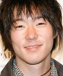

## A. Dataset

**Figure 2. Sample Images of the DemogPairs Dataset across Six Intersectional Demographic Subgroups: (a) Asian Females, (b) Asian Males, (c) Black Females, (d) Black Males, (e) White Females, and (f) White Males.**

- (a) Asian Females:
  
- (b) Asian Males:
  
- (c) Black Females:
  
- (d) Black Males:
  
- (e) White Females:
  
- (f) White Males:
  

Dataset yang digunakan dalam penelitian ini adalah DemogPairs, sebuah dataset yang dirancang khusus untuk pengenalan wajah lintas kelompok demografis. Dataset ini memuat total 10,800 citra wajah yang terdistribusi secara seimbang ke dalam enam kelas interseksional. Keenam subkelompok tersebut mencakup kombinasi persilangan dari tiga kelompok ras makro dan dua kelompok gender, yaitu Asian Females, Asian Males, Black Females, Black Males, White Females, dan White Males, dengan kuota tepat 1,800 citra per kelas. Distribusi yang seimbang ini menyediakan kondisi evaluasi yang lebih terkontrol untuk membandingkan performa antarsubkelompok dengan mengurangi pengaruh ketimpangan jumlah sampel. Sampel visual dari keenam subkelompok demografis diilustrasikan pada [Figure 2](#fig2).

**Table I. Dataset Partition and Demographic Subgroup Distribution.**

| Subgroup | Train Set (80%) | Test Set (20%) | Total |
|---|:---:|:---:|:---:|
| **Black_Males** | 1,440 | 360 | 1,800 |
| **White_Females** | 1,440 | 360 | 1,800 |
| **Asian_Males** | 1,440 | 360 | 1,800 |
| **White_Males** | 1,440 | 360 | 1,800 |
| **Black_Females** | 1,440 | 360 | 1,800 |
| **Asian_Females** | 1,440 | 360 | 1,800 |
| **Total** | **8,640** | **2,160** | **10,800** |

Untuk memastikan integritas pengujian empiris, dataset dibagi menggunakan prosedur stratified split 80/20 (80% data latih dan 20% data uji). Pembagian tersebut menghasilkan 8,640 citra latih dengan 1,440 sampel per kelas serta 2,160 citra uji independen dengan 360 sampel per kelas, sebagaimana dirinci pada [Table I](#tab1). Subset uji tersebut diisolasi secara ketat, tidak pernah dilibatkan selama proses pencarian hyperparameter, dan hanya digunakan untuk evaluasi akhir. Pada tahapan standardisasi citra, setiap citra wajah dikonversi ke dalam format 3-channel Red, Green, Blue (RGB), diubah ukurannya ke resolusi 224 × 224 piksel, dan diskalakan intensitas pikselnya dari rentang [0, 255] menjadi [0, 1] agar selaras dengan masukan model transformer.
