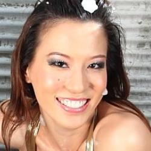
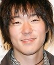

## A. Dataset

**Figure 2. Sample Images of the DemogPairs Dataset across Six Intersectional Demographic Subgroups: (a) Asian Females, (b) Asian Males, (c) Black Females, (d) Black Males, (e) White Females, and (f) White Males.**

- (a) Asian Females:
  
- (b) Asian Males:
  
- (c) Black Females:
  
- (d) Black Males:
  
- (e) White Females:
  
- (f) White Males:
  

Dataset yang digunakan dalam penelitian ini adalah DemogPairs, sebuah dataset yang dirancang khusus untuk pengenalan wajah lintas kelompok demografis [[25]](06_references.md#ref25). Dataset ini memuat total 10,800 citra wajah yang terdistribusi secara seimbang ke dalam enam kelas interseksional. Keenam subkelompok tersebut mencakup kombinasi persilangan dari tiga kelompok ras makro dan dua kelompok gender, yaitu Asian Females, Asian Males, Black Females, Black Males, White Females, dan White Males, dengan alokasi seragam tepat 1,800 citra per kelas. Struktur data yang seimbang ini menyediakan kondisi evaluasi terkontrol untuk membandingkan performa model antarsubkelompok secara objektif, sekaligus memitigasi distorsi yang timbul akibat ketimpangan jumlah sampel [[20]](06_references.md#ref20). Karakteristik visual dari keenam subkelompok demografis diilustrasikan pada [Figure 2](#fig2).

**Table I. Dataset Partition and Demographic Subgroup Distribution.**

| Subgroup | Train Set (80%) | Test Set (20%) | Total |
|---|:---:|:---:|:---:|
| **Black_Males** | 1,440 | 360 | 1,800 |
| **White_Females** | 1,440 | 360 | 1,800 |
| **Asian_Males** | 1,440 | 360 | 1,800 |
| **White_Males** | 1,440 | 360 | 1,800 |
| **Black_Females** | 1,440 | 360 | 1,800 |
| **Asian_Females** | 1,440 | 360 | 1,800 |
| **Total** | **8,640** | **2,160** | **10,800** |

Untuk memastikan integritas pengujian empiris, dataset dibagi menggunakan protokol 80/20 stratified split dengan random_state=42 dan parameter stratify=y. Pembagian tersebut menghasilkan 8,640 citra latih dengan 1,440 sampel per kelas serta 2,160 citra uji held-out independen dengan 360 sampel per kelas pada enam kelas interseksional, sebagaimana dirinci pada [Table I](#tab1). Partisi ini sepenuhnya mengisolasi set uji held-out, sehingga seluruh data uji tidak pernah terlihat saat tuning hyperparameter maupun fitting PCA dan Scaler. Pada tahapan standardisasi citra, setiap citra wajah dikonversi ke format 3-channel Red, Green, Blue (RGB), diubah resolusinya ke 224 × 224 piksel, dan diskalakan intensitas pikselnya dari rentang [0, 255] menjadi [0, 1] untuk model transformer.
