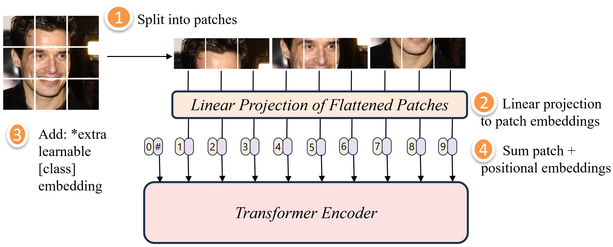

## B. Vision Transformer

Arsitektur ekstraksi representasi visual dalam penelitian ini mengadopsi struktur standar ViT-Base (`vit-base-patch16-224`) yang diilustrasikan pada [Figure 3](#fig3). Citra wajah masukan berukuran 224 × 224 piksel dengan 3 saluran warna terlebih dahulu dibagi menjadi 196 patch spasial non-overlapping berukuran 16 × 16 piksel. Setiap patch diproyeksikan secara linier melalui matriks proyeksi $\mathbf{E}$ ke dalam ruang laten berdimensi $D = 768$ dan dirangkaikan dengan token kelas khusus $\mathbf{x}_{\text{class}}$ serta embedding posisi $\mathbf{E}_{\text{pos}}$, sebagaimana dirumuskan pada [(1)](#eq1). Vektor sekuens token awal $\mathbf{z}_0$ selanjutnya dialirkan ke dalam tumpukan 12 layer transformer encoder identik. Setiap layer encoder memproses representasi melalui mekanisme MHSA setelah normalisasi Layer Normalization (LN) sesuai [(2)](#eq2), yang diikuti oleh blok Multi-Layer Perceptron (MLP) dua lapis dengan fungsi aktivasi GeLU berdasarkan [(3)](#eq3). Mekanisme self-attention dengan 12 attention heads memungkinkan model memetakan relasi spasial global antarpatch citra wajah secara langsung tanpa pembatasan receptive field lokal.

**Figure 3. Architecture of the ViT Backbone and Patch Projection.**

$$
\mathbf{z}_0 = [\mathbf{x}_{\text{class}}; \, \mathbf{x}_p^1\mathbf{E}; \, \dots; \, \mathbf{x}_p^{196}\mathbf{E}] + \mathbf{E}_{\text{pos}} \tag{1}
$$

$$
\mathbf{z}'_\ell = \text{MHSA}(\text{LN}(\mathbf{z}_{\ell-1})) + \mathbf{z}_{\ell-1} \tag{2}
$$

$$
\mathbf{z}_\ell = \text{MLP}(\text{LN}(\mathbf{z}'_\ell)) + \mathbf{z}'_\ell \tag{3}
$$

Untuk mengisolasi efisiensi komputasi dan mencegah variabilitas pelatihan ulang, ketiga model backbone ViT dipertahankan dalam kondisi dibekukan (frozen) sebagai ekstraktor fitur laten secara offline. Model ViT-Face (`skutaada/VIT-VGGFace`) dimanfaatkan untuk menangkap representasi terkait geometri biometrik wajah, ViT-Emotion (`dima806/facial_emotions_image_detection`) menghasilkan representasi terkait ekspresi wajah, dan ViT-Age (`dima806/facial_age_image_detection`) mengekstraksi representasi terkait estimasi usia wajah. Dari setiap model domain, vektor fitur $\mathbf{f}_{\text{domain}} \in \mathbb{R}^{768}$ diekstraksi dari representasi token $[\text{CLS}]$ pada layer encoder terakhir $L$ setelah normalisasi LayerNorm sesuai [(4)](#eq4). Ketiga representasi laten domain tunggal tersebut digabungkan melalui operasi konkatenasi fitur $\mathbf{z}_{\text{tri}} = \mathbf{f}_{\text{face}} \oplus \mathbf{f}_{\text{emotion}} \oplus \mathbf{f}_{\text{age}} \in \mathbb{R}^{2304}$ sebagaimana dirumuskan pada [(5)](#eq5). Eksplorasi sistematis mencakup tujuh skema ablasi fitur, yang meliputi tiga konfigurasi domain tunggal berdimensi 768, tiga konfigurasi domain ganda berdimensi 1.536, serta satu konfigurasi tri-domain berdimensi 2.304 seperti dirangkum pada [Table II](#tab2).

$$
\mathbf{f}_{\text{domain}} = \text{LN}(\mathbf{z}_L^0) \in \mathbb{R}^{768} \tag{4}
$$

$$
\mathbf{z}_{\text{tri}} = \mathbf{f}_{\text{face}} \oplus \mathbf{f}_{\text{emotion}} \oplus \mathbf{f}_{\text{age}} \in \mathbb{R}^{2304} \tag{5}
$$

**Table II. Multi-Domain Feature Fusion and Ablation Configurations.**

| # | Configuration | Domain Category | Dimension |
|:---:|---|:---:|:---:|
| 1 | `Face` | Single-Domain | 768 |
| 2 | `Emotion` | Single-Domain | 768 |
| 3 | `Age` | Single-Domain | 768 |
| 4 | `Emotion ⊕ Face` | Dual-Domain | 1,536 |
| 5 | `Face ⊕ Age` | Dual-Domain | 1,536 |
| 6 | `Emotion ⊕ Age` | Dual-Domain | 1,536 |
| 7 | `Face ⊕ Emotion ⊕ Age` | **Tri-Domain (Proposed)** | **2,304** |
