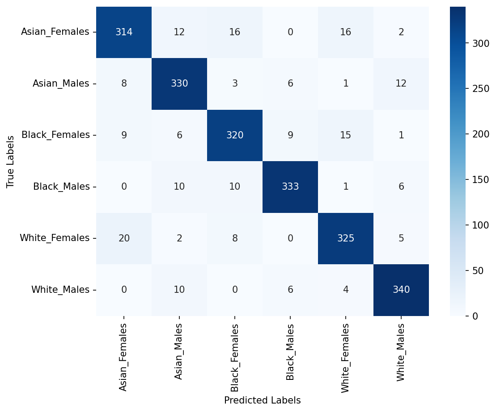

## D. Error Pattern Analysis

Pergeseran distribusi kesalahan klasifikasi dari skema domain tunggal menuju konfigurasi ganda dan tiga domain dianalisis melalui diagram matriks konfusi pada [Figure 4](#fig4), yang mencakup Figure 4a, Figure 4b, dan Figure 4c. Evaluasi empiris menunjukkan bahwa total misklasifikasi pada 2.160 data uji held-out menurun secara konsisten seiring perluasan domain representasi laten. Model SVM domain tunggal Face menghasilkan 198 kesalahan prediksi, yang kemudian berkurang menjadi 145 sampel pada skema dual-domain Emotion ⊕ Face. Konfigurasi tri-domain Face ⊕ Emotion ⊕ Age menekan kesalahan klasifikasi hingga mencapai titik terendah sebesar 136 sampel. Penurunan kesalahan yang konsisten ini membuktikan bahwa fusi representasi multi-domain mempertegas batas pemisahan antar-subkelompok demografis di ruang fitur laten.

**Figure 4. Confusion Matrices across Feature Fusion Schemes on the Held-Out Test Set: (a) Single-Domain (`Face`), (b) Dual-Domain (`Emotion ⊕ Face`), and (c) Tri-Domain (`Face ⊕ Emotion ⊕ Age`).**

*(a) Single-Domain (Face):*

*(b) Dual-Domain (Emotion ⊕ Face):*

*(c) Tri-Domain (Face ⊕ Emotion ⊕ Age):*

Pemeriksaan mendalam terhadap matriks konfusi model domain tunggal Face pada [Figure 4(a)](#fig4a) mengungkap bahwa kesalahan klasifikasi terkonsentrasi secara dominan pada subkelompok antarras dalam gender yang sama. Kecenderungan tersebut terlihat sangat menonjol pada kohort wanita, di mana subkelompok Asian_Females mengalami 46 misklasifikasi, yang mencakup 16 sampel terprediksi sebagai White_Females dan 16 sampel sebagai Black_Females. Sebaliknya, subkelompok White_Females mencatatkan 20 kesalahan prediksi yang terdistribusi ke Asian_Females. Pola empiris ini konsisten dengan kemungkinan adanya tumpang tindih fenotipe (phenotypic overlap) antarras pada representasi geometri biometrik wajah tunggal. Meskipun demikian, bukti matriks konfusi tersebut tidak membuktikan bahwa faktor tumpang tindih visual merupakan penyebab tunggal dari seluruh misklasifikasi yang teramati.

Perubahan distribusi kesalahan klasifikasi pada model dual-domain Emotion ⊕ Face dianalisis lebih lanjut berdasarkan matriks konfusi pada [Figure 4(b)](#fig4b). Penambahan representasi laten ekspresi afektif secara efektif mereduksi pola misklasifikasi antarras pada subkelompok bergender sama, terutama pada kelompok wanita. Kesalahan prediksi dari Asian_Females ke White_Females berhasil ditekan secara nyata dari 16 kasus menjadi 9 kasus. Pada saat yang bersamaan, jumlah sampel prediksi benar (true positive) pada subkelompok White_Females meningkat dari 325 citra menjadi 334 citra. Integrasi sinyal dinamis ekspresi wajah tersebut memperkuat batas pembeda visual antarras dalam ruang representasi laten, sehingga pengklasifikasi mampu membedakan fitur morfologi yang serupa dengan tingkat kepastian yang lebih kokoh dan stabil.

Pola misklasifikasi pada konfigurasi tri-domain Face ⊕ Emotion ⊕ Age dievaluasi secara komprehensif berdasarkan matriks konfusi pada [Figure 4(c)](#fig4c). Integrasi representasi domain usia meningkatkan jumlah prediksi benar secara konsisten pada subkelompok Asian_Females menjadi 333 sampel dan White_Females menjadi 341 sampel. Selain itu, kesalahan klasifikasi lintas gender, yaitu kondisi ketika subjek wanita tertukar menjadi pria atau sebaliknya, hanya berjumlah 51 kasus dari total 2.160 data uji held-out (2.36%). Temuan empiris ini membuktikan bahwa batas antargender terpisah dengan sangat tegas di dalam ruang representasi laten multi-domain, sehingga kesalahan klasifikasi yang tersisa pada model tri-domain hampir seluruhnya didominasi oleh misklasifikasi antarras di dalam kelompok gender yang sama.
