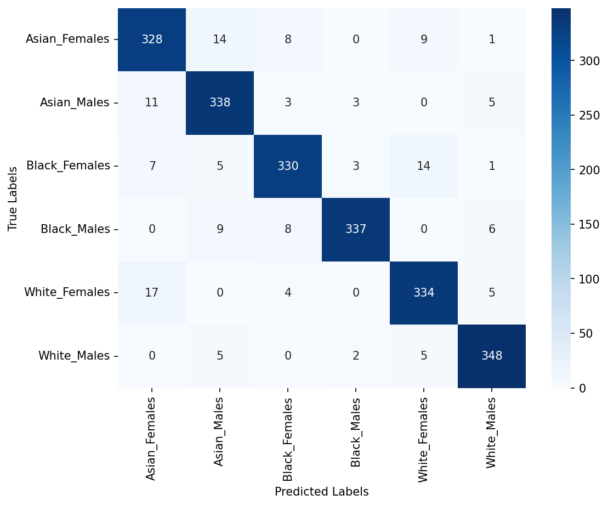

# Paper Outline Terperinci - IEEE Access / Q1 Journal

> **Target Publikasi**: Artikel Jurnal Internasional Bereputasi (IEEE Access / Pattern Recognition / Image and Vision Computing)  
> **Bahasa Naskah**: Bahasa Indonesia formal dengan istilah akademik/teknis tetap dalam Bahasa Inggris  
> **Gaya Sitasi**: IEEE format (sitasi teks berbasis nama penulis dan judul tanpa penomoran numerik dulu)  
> **Topik Riset**: Klasifikasi Ras & Gender Interseksional Berbasis Fusi Fitur Tri-Domain Vision Transformer dan Support Vector Classifier Teroptimasi

---

## 0. Global Writing Rules and Claim Boundaries

### A. Allowed Claims and Core Focus
1. **Fokus Utama**: Evaluasi empiris sistematis fusi fitur representasi laten dari tiga domain visual wajah komplementer (task-associated representations: Face biometrics, Facial Emotion, dan Facial Age) menggunakan Vision Transformer (ViT) pra-latih (offline feature extraction) dipadukan dengan optimasi pipeline classical machine learning (GridSearchCV 5-Fold Stratified Cross-Validation).
2. **Klaim Keunggulan Tri-Domain**: Fusi tri-domain (2.304 dimensi) menghasilkan performa tertinggi pada **3 dari 4 classifier** yang dievaluasi (Support Vector Classifier / SVC, Logistic Regression / LR, dan Gaussian Naive Bayes / GNB), dengan model terbaik **SVC Tri-Domain** (`Face ⊕ Emotion ⊕ Age`) mencapai akurasi **93.70%** dan F1-Score **0.9369** pada dataset DemogPairs (N=2.160 data uji). Pada Random Forest (RF), konfigurasi terbaik dicapai oleh skema dual-domain `Emotion ⊕ Face` (0.8685).
3. **Analisis Disparitas Subkelompok (Subgroup Disparity Analysis)**: Evaluasi performa antarsubkelompok dilakukan pada model tri-domain terbaik, di mana subgroup F1-Score seluruh 6 kelas berada di atas 0.91 dengan rentang 0.9174 s.d. 0.9614 pada model SVC Tri-Domain, dan ΔF1 = 0.0440. Pada model LR Tri-Domain, ΔF1 = 0.0422. Disparitas rentang (max - min) digunakan sebagai indikator sederhana variasi performa antarsubgrup, bukan sebagai ukuran fairness yang komprehensif.
4. **Metodologi Pencegahan Kebocoran Informasi**: Pipeline preprocessing dan validasi silang dirancang untuk mencegah kebocoran informasi (*information leakage*) dengan melakukan fitting penskalaan (Scaler) dan Principal Component Analysis (PCA) secara eksklusif hanya pada fold latih di dalam GridSearchCV, serta evaluasi akhir dilakukan pada subset uji held-out yang belum pernah dilihat selama proses pelatihan.
5. **Standarisasi Istilah & Konvensi Penulisan**:
   - Dilarang keras menggunakan karakter em dash (tanda pisah panjang); gunakan tanda pisah biasa (- atau --), tanda kurung ( ), atau koma (,).
   - Pengklasifikasi berbasis support vector distandardisasi dengan istilah **Support Vector Classifier (SVC)** (berbasis implementasi `sklearn.svm.SVC`).
   - Setiap istilah teknis yang memiliki singkatan resmi (seperti ViT, SVC, RF, GNB, LR, PCA, Multi-Head Self-Attention / MHSA, Convolutional Neural Networks / CNN) wajib ditulis lengkap beserta singkatannya pada pemunculan pertama di awal naskah (misalnya di Abstract atau awal Introduction). Pada kemunculan berikutnya di seluruh naskah, cukup gunakan singkatannya saja (misal: ViT, SVC, RF, GNB, LR, PCA, MHSA).
   - Penamaan konfigurasi fitur ditulis seragam menggunakan simbol direct sum `⊕` untuk fusi konkatenasi (misal: `Face`, `Emotion`, `Age`, `Face ⊕ Age`, `Emotion ⊕ Age`, `Emotion ⊕ Face`, `Face ⊕ Emotion ⊕ Age`).
   - Dilarang menggunakan kata "significantly" tanpa adanya uji signifikansi statistik formal (statistical hypothesis testing); gunakan kata "substantially", "considerably", "notably", atau "achieved higher performance".
   - Hindari klaim "state-of-the-art" mutlak; gunakan "the highest performance among the compared studies on DemogPairs" atau "outperformed the compared methods".
   - Usahakan maksimal 3 sitasi per kalimat untuk mencegah penumpukan sitasi (*citation dumping*).
   - Penempatan Eksplisit Pernyataan Etika (*Ethical Statement*): Dialokasikan secara struktural sebagai sub-bab tersendiri pada **Section III.I (Ethical Considerations and Responsible AI Use)**.
   - Kepatuhan Mutlak Urutan Master Elemen: Urutan pemunculan seluruh Gambar (Figure 1-4), Tabel (Table I-XII), dan Persamaan (Eq. 1-19) pada naskah LaTeX wajib mematuhi secara ketat urutan kronologis yang tercantum pada tabel *Master Element Sequence & Layout Specifications*.
   - Pelaporan Parameter Aktif pada Tabel Hasil (Table VII-X): Pada penulisan naskah akhir, parameter yang tidak aktif atau tidak relevan untuk konfigurasi terpilih (misalnya `degree` pada kernel RBF/linear, atau `gamma` pada kernel linear) tidak boleh ditampilkan seolah-olah berpengaruh; tampilkan hanya parameter yang aktif secara fungsional atau beri tanda strip (-) / N/A untuk menjaga ketepatan teknis.
   - Seluruh persamaan matematika diberi nomor berurutan secara individual dari (1) hingga (19).
   - Seluruh tabel yang memiliki kolom lebar atau memuat parameter model wajib diinstruksikan berformat LaTeX Full Width (`\begin{table*} ... \end{table*}`).

### B. Negative Constraints and Disallowed Claims
1. **Dilarang membahas identitas subjek**: Tidak ada pembahasan mengenai identity-level split, identity leakage, subject identity, atau identity-aware split. Fokus penelitian murni pada **klasifikasi ras dan gender interseksional**.
2. **Dilarang mengklaim "zero data leakage" absolut**: Gunakan formulasi terbatas bahwa pipeline dirancang secara metodologis untuk mencegah kebocoran data (*prevent information leakage*).
3. **Dilarang mengklaim bahwa dataset balanced otomatis menghilangkan bias**: Dataset seimbang (*balanced evaluation setting*) menyediakan distribusi kelas yang setara untuk mengevaluasi disparitas performa tanpa pengaruh ketidakseimbangan sampel, bukan jaminan bahwa bias sosial telah sepenuhnya tereliminasi.
4. **Dilarang mengklaim peningkatan universal (universal improvement)**: Jelaskan secara faktual bahwa tri-domain unggul pada 3 dari 4 classifier, sementara Random Forest mencapai puncak pada dual-domain `Emotion ⊕ Face`.
5. **Dilarang mengklaim ortogonalitas Age**: Gunakan istilah "complementary informational contribution" atau "additional discriminative information provided by Age-associated representations".
6. **Dilarang mengklaim keunggulan matematis mutlak polynomial kernel**: Pembahasan difokuskan pada analisis empiris konfigurasi kernel SVC terpilih dalam search space yang dievaluasi. Suku konstan $\text{coef0} = 0.0$ pada formulasi kernel polinomial merupakan nilai bawaan (default) pada `sklearn.svm.SVC` dan tidak diikutsertakan sebagai hyperparameter yang divariasikan dalam grid search.
7. **Pisahkan temuan empiris (empirical findings) dan interpretasi teoretis (conceptual interpretations)**.
8. **Jangan mengklaim model siap untuk penegakan hukum atau pengawasan publik tanpa pengawasan etis**. Wajib disertakan batasan etika AI (ethical statement).
9. **Jelaskan secara jujur eliminasi XGBoost** pada fase eksplorasi awal karena batasan komputasi GPU / inkompatibilitas CUDA pada environment lokal dan efisiensi waktu pelatihan.
10. **Batasan generalisasi ras**: DemogPairs secara spesifik berfokus pada 3 kelompok ras makro (Asian, Black, White).

### C. Equation Plan and Mathematical Notation
- **Ekstraksi ViT**: Formulasi sequence token [(1)](#eq1), multi-head self-attention MHSA [(2)](#eq2), layer MLP [(3)](#eq3), dan ekstraksi token representasi [CLS] [(4)](#eq4).
- **Fusi Fitur (Concatenation / Direct Sum)**: Konkatenasi vektor representasi laten multi-domain [(5)](#eq5).
- **Klasifikasi Probabilistik GNB**: Likelihood Gaussian bersyarat [(6)](#eq6).
- **Klasifikasi Multinomial LR**: Fungsi probabilitas Softmax [(7)](#eq7).
- **Optimasi Kernel SVC**: Kernel polinomial derajat 2 [(8)](#eq8).
- **Pipeline Transformasi**: Rantai transformasi Scaler - PCA - Classifier [(9)](#eq9).
- **Metrik Evaluasi per-Subkelompok (One-vs-Rest)**: Formulasi kanonikal Accuracy [(10)](#eq10), Precision [(11)](#eq11), Recall [(12)](#eq12), dan F1-Score [(13)](#eq13) per kelas.
- **Metrik Evaluasi Agregasi Global**: Formulasi Overall Accuracy [(14)](#eq14), Global Precision [(15)](#eq15), Global Recall [(16)](#eq16), dan Global F1-Score [(17)](#eq17).
- **Metrik Disparitas Keadilan Antarsubkelompok**: Formulasi gap rentang disparitas Recall [(18)](#eq18) dan F1-Score [(19)](#eq19).
- **Disiplin Simbol Sederhana**: Penulisan ukuran dimensi (224 × 224), operasi aritmetika (768 + 768 + 768 = 2304), rasio (80/20, 3 Ras × 2 Gender), dan rentang (±5%) wajib menggunakan teks biasa tanpa math mode.

---

## Front Matter

### Paper Title
**Multi-Domain Vision Transformer Fusion for Intersectional Demographic Classification from Facial Images**  
*(Fusi Vision Transformer Multi-Domain untuk Klasifikasi Demografis Interseksional dari Citra Wajah)*

### Authors & Affiliation
1. **Dr. Ir. Ricky Eka Putra, S.Kom., M.Kom.** ([ORCID](https://orcid.org/0000-0002-5515-7967)) - *Department of Informatics, Faculty of Informatics, Universitas Negeri Surabaya, Surabaya, Indonesia* (Corresponding Author: `rickyeka@unesa.ac.id`)
2. **Rezky Arisanti Putri, S.Kom., M.Kom.** ([ORCID](https://orcid.org/0009-0000-8021-1833)) - *Department of Informatics, Faculty of Informatics, Universitas Negeri Surabaya, Surabaya, Indonesia*
3. **Dr. Yuni Yamasari, S.Kom., M.Kom.** ([ORCID](https://orcid.org/0000-0001-9719-3491)) - *Department of Informatics, Faculty of Informatics, Universitas Negeri Surabaya, Surabaya, Indonesia*
4. **Rafy Aulia Akbar, S.Kom., M.Kom.** ([ORCID](https://orcid.org/0009-0003-6991-0694)) - *Department of Informatics, Faculty of Informatics, Universitas Negeri Surabaya, Surabaya, Indonesia*

### Abstract
Satu paragraf terpadu, **target 150-200 kata**, dengan alur: **Latar Belakang → Tujuan Penelitian → Metode yang Diusulkan → Hasil Eksperimen → Kesimpulan**.
- **Latar Belakang**: Pengenalan atribut demografis wajah (ras dan gender) secara simultan menghadapi tantangan variasi ekspresi dinamis, degradasi morfologi penuaan biologis, tumpang tindih visual (phenotypic overlap), dan keterbatasan representasi domain tunggal, sehingga dibutuhkan pendekatan komprehensif yang mampu memodelkan representasi visual wajah lintas-domain secara terpadu.
- **Tujuan**: Mengusulkan kerangka kerja fusi fitur laten lintas-domain (cross-domain feature fusion) dari tiga Vision Transformer (ViT) pra-latih yang menangkap representasi terkait struktur biometrik wajah, ekspresi emosi, dan estimasi usia dipadukan dengan optimasi pipeline classical machine learning untuk klasifikasi atribut demografis wajah secara interseksional.
- **Metode**: Representasi laten diekstraksi secara offline dari tiga model ViT pra-latih (ViT-Face, ViT-Emotion, ViT-Age) pada dataset DemogPairs. Berbagai skema ablasi fusi fitur dievaluasi melalui 5-Fold Stratified Cross-Validation pada empat algoritma pengklasifikasi (Random Forest / RF, Gaussian Naive Bayes / GNB, Logistic Regression / LR, dan Support Vector Classifier / SVC) dengan optimasi hyperparameter GridSearchCV.
- **Hasil**: Model SVC berbasis fusi fitur tri-domain (`Face ⊕ Emotion ⊕ Age`) meraih performa tertinggi di antara metode yang dibandingkan dengan **Accuracy 93.70%**, **Precision 93.72%**, **Recall 93.70%**, dan **F1-Score 93.69%**.
- **Kesimpulan**: Fusi fitur tri-domain mencapai performa terbaik pada tiga dari empat classifier yang dievaluasi, dengan nilai F1-Score pada keenam subkelompok berada pada kisaran 91.74% hingga 96.14%.

### Keywords
Facial demographic recognition; intersectional classification; Vision Transformer; multi-domain feature fusion; algorithmic fairness; Support Vector Classifier; DemogPairs.

---

## I. INTRODUCTION

Introduction disusun dalam 7 paragraf berbobot dengan alur narasi yang kohesif:

```
[Paragraph 1: Urgensi Demografis Wajah & Isu Disparitas Performa]
                    │
                    ▼
[Paragraph 2: Formulasi Klasifikasi Interseksional Terpadu]
                    │
                    ▼
[Paragraph 3: Perkembangan Metode & Vision Transformers (Daftar Paper)]
                    │
                    ▼
[Paragraph 4: Kesenjangan Riset (Research Gaps)]
                    │ (Transisi Mulus / Kohesif)
                    ▼
[Paragraph 5: Usulan Solusi: Kerangka Kerja Tri-Domain ViT]
                    │
                    ▼
[Paragraph 6: Empat Kontribusi Utama Penelitian]
                    │
                    ▼
[Paragraph 7: Organisasi Artikel]
```

### Paragraph 1: Demographic Face Recognition and Performance Disparity
- **Target Kata**: 100-150 kata (minimal 100 kata, maksimal 150 kata).
- **Tujuan**: Menjelaskan urgensi analisis atribut demografis wajah (ras dan gender) pada sistem visi komputer modern serta memaparkan tantangan kritis disparitas performa terhadap subkelompok tertentu.
- **Poin Narasi**:
  1. Pengenalan otomatis atribut demografis wajah memegang peranan penting pada forensik digital, kontrol akses biometrik, interaksi manusia-komputer, dan personalisasi layanan cerdas.
  2. Sejumlah studi melaporkan bahwa sistem visi komputer komersial dan akademik memperlihatkan disparitas performa terhadap subkelompok tertentu; beberapa penelitian mencatat penurunan akurasi pada kelompok wanita dan populasi berkulit gelap [sitasi pendukung diperlukan].
  3. Ketimpangan ini dikaitkan dengan berbagai faktor, termasuk karakteristik distribusi data latih dan keterbatasan ekstraktor fitur konvensional dalam menangkap ciri representatif yang invarian terhadap variasi visual wajah [sitasi pendukung diperlukan].
- **Transisi / Kalimat Penutup**: Keterbatasan penanganan variasi visual pada sistem konvensional ini memperlihatkan bahwa pengenalan atribut demografis yang akurat masih menghadapi tantangan, sehingga dibutuhkan pendekatan pengenalan demografis wajah yang mampu memodelkan interaksi ras dan gender secara terpadu.

### Paragraph 2: From Isolated Tasks to Intersectional Classification
- **Target Kata**: 100-150 kata (minimal 100 kata, maksimal 150 kata).
- **Tujuan**: Menjelaskan transisi dari klasifikasi atribut terisolasi (ras saja atau gender saja) menuju klasifikasi interseksional terpadu (kombinasi ras dan gender).
- **Poin Narasi**:
  1. Sebagian besar literatur memformulasikan pengenalan ras dan gender sebagai dua tugas terpisah yang independen.
  2. Pendekatan terisolasi tersebut tidak secara eksplisit mengevaluasi performa pada kelompok interseksional (seperti Black Females atau Asian Females), sehingga penurunan performa yang terkonsentrasi pada persilangan subgrup tertentu dapat luput dari pengamatan.
  3. Formulasi interseksional terpadu pada pengaturan evaluasi seimbang (balanced evaluation setting) memberikan landasan evaluasi komparatif yang lebih objektif untuk mengukur variasi performa antarsubkelompok.
- **Transisi / Kalimat Penutup**: Pemodelan klasifikasi interseksional menuntut representasi visual yang kaya dan mampu memisahkan batas keputusan antarsubkelompok yang saling tumpang tindih, sehingga dibutuhkan arsitektur ekstraksi representasi visual yang tangguh terhadap variasi fenotipe dan ekspresi wajah.

### Paragraph 3: Recent Architectural Advances and Vision Transformers
- **Target Kata**: 150-275 kata (paragraf khusus pembahasan penelitian sebelumnya, maksimal 275 kata).
- **Aturan Sitasi Khusus**: Usahakan maksimal 3 sitasi per kalimat untuk menjaga keterbacaan naskah.
- **Tujuan**: Memberikan konteks perkembangan pendekatan arsitektur dari CNN konvensional ke ViT serta metode pendukung lainnya dalam pengenalan atribut wajah.
- **Poin Narasi**:
  1. Pendekatan klasik berbasis fitur buatan tangan (handcrafted features: LBP, HOG, SIFT) dan Convolutional Neural Networks (CNN: VGG, ResNet, Xception) mengandalkan bias induktif lokal melalui receptive field terbatas, di mana penangkapan dependensi spasial global membutuhkan tumpukan lapisan yang lebih dalam.
  2. Arsitektur Vision Transformer (ViT) memperkenalkan mekanisme Multi-Head Self-Attention (MHSA) yang memungkinkan pemodelan interaksi spasial global antar-patch citra secara langsung tanpa dibatasi receptive field lokal.
  3. Berbagai variasi pendekatan telah dieksplorasi dalam literatur, mencakup model berbasis wilayah wajah tengah, pembelajaran multi-tugas multi-skala, modul atensi paralel, mitigasi bias berbasis model generatif, hingga arsitektur transformer multi-aksis (MaxViT).
- **Daftar Sitasi Wajib Berdasarkan Judul Paper pada Related Works**:
  1. *Automatic Ethnicity Classification from Middle Part of the Face Using Convolutional Neural Networks* (Belcar et al., Sensors 2022)
  2. *Face Gender and Age Classification Based on Multi-Task, Multi-Instance and Multi-Scale Learning* (Liao et al., Applied Sciences 2022)
  3. *Intelligent deep learning based ethnicity recognition and classification using facial images* (Sunitha et al., Image and Vision Computing 2022)
  4. *A Multidimensional Analysis of Social Biases in Vision Transformers* (Brinkmann et al., ICCV 2023)
  5. *Deep Generative Views to Mitigate Gender Classification Bias Across Gender-Race Groups* (Ramachandran & Rattani, Springer / ICPR Workshops 2023)
  6. *Learning an attention-aware parallel sharing network for facial attribute recognition* (Chen et al., JVCI 2023)
  7. *Classifying Gender Based on Face Images Using Vision Transformer* (Tahyudin et al., JOIV 2024)
  8. *Ethnicity Classification Based on Facial Images using Deep Learning Approach* (Kalkatawi & Saeed, IJACSA 2024)
  9. *Dual Vision Transformer Integration for Race and Gender Recognition Based on Facial Images* (Putri et al., IEEE ICVEE 2025)
  10. *MD-ViT: Multidomain Vision Transformer Fusion for Fair Demographic Attribute Recognition* (Putri et al., JIEET 2025)
- **Transisi**: Terlepas dari pesatnya eksplorasi model berbasis visi dan transformer tersebut, telaah literatur mengidentifikasi sejumlah tantangan metodologis yang masih memerlukan kajian empiris terpadu.

### Paragraph 4: Research Gaps in Facial Demographic Recognition
- **Target Kata**: 100-150 kata (minimal 100 kata, maksimal 150 kata).
- **Tujuan**: Merumuskan kesenjangan riset utama (research gaps) yang mengaitkan keterbatasan representasi domain tunggal, variasi penuaan, dan optimasi classifier hilir.
- **Poin Narasi**:
  1. *Keterbatasan Representasi Visual Tunggal*: Sejumlah studi dalam literatur berfokus pada representasi biometrik wajah tunggal tanpa mengintegrasikan isyarat visual afektif dinamis secara simultan, sehingga menghadapi tantangan ketika membedakan subkelompok dengan derajat tumpang tindih visual (phenotypic overlap) yang tinggi.
  2. *Sensitivitas terhadap Variasi Usia*: Beberapa penelitian melaporkan adanya variasi performa pengenalan demografis ketika dihadapkan pada perubahan morfologi wajah seiring usia jika fitur terkait estimasi penuaan biologis tidak diikutsertakan.
  3. *Eksplorasi Pipeline Classifier Hilir yang Terbatas*: Studi terdahulu umumnya belum mengkaji secara komparatif perilaku batas keputusan antarmodel classifier hilir (linier, probabilistik, ensemble, dan berbasis kernel) serta interaksinya dengan penskalaan fitur dan reduksi dimensionalitas pada ruang representasi laten transformer.
- **Transisi Kohesif ke Usulan Solusi**: Guna menjembatani keterbatasan representasi domain tunggal serta mengevaluasi batas keputusan classifier hilir tersebut, penelitian ini mengusulkan integrasi tiga domain representasi Vision Transformer yang dipadukan dengan optimasi pipeline classical classifier terstruktur.

### Paragraph 5: Proposed Multi-Domain Feature Fusion Framework
- **Target Kata**: 150-250 kata (paragraf khusus usulan solusi).
- **Tujuan**: Memaparkan kerangka kerja usulan yang menjawab seluruh kesenjangan riset pada Paragraf 4 secara konseptual dan sistematis (tanpa menyebutkan rincian jumlah dimensi, jumlah konfigurasi, atau total fitting yang akan dibahas pada Bab III).
- **Poin Narasi**:
  1. Mengusulkan kerangka kerja fusi fitur Tri-Domain ViT yang mengombinasikan tiga domain representasi: ViT-Face (representasi terkait geometri biometrik wajah), ViT-Emotion (representasi terkait ekspresi wajah), dan ViT-Age (representasi terkait usia wajah) menjadi satu representasi terpadu via operasi konkatenasi (`Face ⊕ Emotion ⊕ Age`).
  2. Ekstraksi fitur dilakukan secara offline dari backbone pra-latih yang dibekukan untuk menjaga efisiensi dan mengisolasi variabilitas komputasi.
  3. Representasi laten dievaluasi melalui berbagai skema ablasi fitur domain tunggal, dual domain, dan tri-domain pada empat algoritma classical machine learning (RF, GNB, LR, SVC).
  4. Optimasi hyperparameter dilakukan melalui validasi silang Stratified Cross-Validation dengan pipeline modular Scaler-PCA yang dirancang untuk mencegah kebocoran informasi.

### Paragraph 6: Key Contributions
- **Target Kata**: 200-250 kata (paragraf khusus kontribusi utama).
- **Tujuan**: Menyajikan empat kontribusi ilmiah penelitian secara konseptual dalam Bahasa Inggris disertai terjemahan Bahasa Indonesia, tanpa mengkhususkan SVC pada poin benchmarking, tidak menyebut DemogPairs sebagai benchmark (melainkan dataset utama), tanpa rincian angka numerik/hyperparameter spesifik, serta menjelaskan esensi analisis disparitas subkelompok.
- **Poin Narasi (English & Indonesian Translation)**:
  1. **A Tri-Domain Vision Transformer feature fusion framework** integrating face-associated biometric representations, expression-related representations, and age-associated facial representations into a unified latent feature vector for intersectional demographic classification.  
     *(Kerangka kerja fusi fitur Tri-Domain Vision Transformer yang mengintegrasikan representasi terkait biometrik wajah, representasi terkait ekspresi, dan representasi terkait usia wajah ke dalam vektor fitur laten terpadu untuk klasifikasi demografis interseksional).*
  2. **An empirical comparative benchmark across multiple feature ablation schemes and classical machine learning classifiers** optimized via Stratified Cross-Validation hyperparameter tuning, examining decision boundary behavior across linear, probabilistic, ensemble, and kernel-based models.  
     *(Tolok ukur komparatif empiris melintasi berbagai skema ablasi fitur dan pengklasifikasi pembelajaran mesin klasik yang dioptimalkan melalui penyetelan hyperparameter validasi silang berstrata, mengkaji perilaku batas keputusan antarmodel linier, probabilistik, ensemble, dan berbasis kernel).*
  3. **Competitive classification performance on the DemogPairs dataset**, achieving higher reported performance compared to the evaluated single-domain and dual-domain configurations on the majority of classifiers.  
     *(Capaian performa klasifikasi kompetitif pada dataset DemogPairs yang mencapai performa lebih tinggi dibandingkan konfigurasi domain tunggal dan domain ganda yang dievaluasi pada mayoritas pengklasifikasi).*
  4. **An intersectional subgroup performance and disparity analysis**, evaluating subgroup-level classification performance and performance variation across demographic subgroups using range-based disparity metrics - noting that this constitutes a subgroup performance analysis rather than a comprehensive fairness assessment.  
     *(Analisis performa dan disparitas subkelompok interseksional, mengevaluasi performa klasifikasi per-subkelompok dan variasi performa antarsubkelompok demografis menggunakan metrik disparitas berbasis rentang - dengan catatan bahwa ini merupakan analisis performa subkelompok dan bukan penilaian fairness yang komprehensif).*

### Paragraph 7: Paper Organization
- **Target Kata**: 75-100 kata (minimal 75 kata, maksimal 100 kata).
- **Tujuan**: Menjelaskan sistematika dan fungsi setiap bab dalam artikel secara ringkas dan padat.
- **Poin Narasi**:
  Artikel ini disusun sebagai berikut: Section II mengulas sintesis literatur terkait (Related Works); Section III menjabarkan dataset, metodologi ekstraksi multi-domain ViT, pipeline pengklasifikasi, dan pertimbangan etika (Materials and Methods); Section IV memaparkan analisis komparatif performa global, studi ablasi, analisis disparitas subkelompok, pola kesalahan, dan perbandingan dengan literatur terdahulu (Results and Discussion); Section V menyimpulkan temuan utama, keterbatasan, dan arah riset mendatang (Conclusion).

---

## II. RELATED WORKS

Sintesis literatur disusun dalam 6 paragraf terstruktur tanpa subjudul, masing-masing dengan target **100-115 kata**:

### Paragraph 1: Facial Attribute and Demographic Recognition
- **Target Kata**: 100-115 kata (minimal 100 kata, maksimal 115 kata).
- **Fokus Sintesis**: Evolusi tugas pengenalan ras dan gender wajah dari deskriptor konvensional berbasis bagian (part-based) dan fitur buatan tangan (handcrafted features: LBP, HOG, Gabor) ke model representasi mendalam. Menguraikan bagaimana representasi konvolusional klasik berinteraksi dengan variasi pencahayaan dan disparitas performa antarras (Other-Race Effect) sebagaimana dilaporkan dalam literatur empiris.
- **Sumber Literatur Terkait**:
  1. `[(1)]` *Automatic Ethnicity Classification from Middle Part of the Face Using Convolutional Neural Networks* (Belcar et al., Sensors 2022)
  2. `[(3)]` *Intelligent deep learning based ethnicity recognition and classification using facial images* (Sunitha et al., IVC 2022)
  3. `[(6)]` *Learning an attention-aware parallel sharing network for facial attribute recognition* (Chen et al., JVCI 2023)

### Paragraph 2: Vision Transformers for Face Representation
- **Target Kata**: 100-115 kata (minimal 100 kata, maksimal 115 kata).
- **Fokus Sintesis**: Penerapan arsitektur Vision Transformer (ViT) dalam analisis biometrik wajah. Menjelaskan karakteristik struktural mekanisme Multi-Head Self-Attention (MHSA) yang memfasilitasi pemodelan dependensi spasial global antarpatch citra secara langsung, serta eksplorasi model transformer hibrida seperti MaxViT, dengan memisahkan karakteristik desain arsitektur dari evaluasi performa empirisnya.
- **Sumber Literatur Terkait**:
  1. `[(4)]` *A Multidimensional Analysis of Social Biases in Vision Transformers* (Brinkmann et al., ICCV 2023)
  2. `[(7)]` *Classifying Gender Based on Face Images Using Vision Transformer* (Tahyudin et al., JOIV 2024)
  3. `[(8)]` *Ethnicity Classification Based on Facial Images using Deep Learning Approach* (Kalkatawi & Saeed, IJACSA 2024)

### Paragraph 3: Demographic Disparities and Fairness in Vision Systems
- **Target Kata**: 100-115 kata (minimal 100 kata, maksimal 115 kata).
- **Fokus Sintesis**: Analisis terhadap disparitas performa dalam model visi komputer dan teknik evaluasi demografis. Menekankan bahwa evaluasi pada dataset berdistribusi seimbang menyediakan kondisi terkontrol untuk membandingkan performa antarsubkelompok tanpa distorsi ketidakseimbangan sampel (tanpa mengimplikasikan bahwa distribusi seimbang secara otomatis menghilangkan bias sosial). Mengulas teknik mitigasi generatif seperti StyleGAN2 dan analisis bias sosial pada encoder transformer.
- **Sumber Literatur Terkait**:
  1. `[(4)]` *A Multidimensional Analysis of Social Biases in Vision Transformers* (Brinkmann et al., ICCV 2023)
  2. `[(5)]` *Deep Generative Views to Mitigate Gender Classification Bias Across Gender-Race Groups* (Ramachandran & Rattani, Springer 2023)

### Paragraph 4: Multi-Domain and Multi-Task Feature Fusion
- **Target Kata**: 100-115 kata (minimal 100 kata, maksimal 115 kata).
- **Fokus Sintesis**: Perkembangan pendekatan fusi representasi multi-skala, multi-task, dan multi-domain pada analisis atribut wajah. Mengulas keterbatasan pendekatan representasi tunggal yang tidak secara simultan memodelkan variasi dari berbagai aspek visual (seperti geometri wajah, ekspresi afektif, dan usia), serta menelaah temuan empiris penggabungan fitur laten antardomain tanpa mengklaim komplementaritas teoretis yang mutlak.
- **Sumber Literatur Terkait**:
  1. `[(2)]` *Face Gender and Age Classification Based on Multi-Task, Multi-Instance and Multi-Scale Learning* (Liao et al., Applied Sciences 2022)
  2. `[(6)]` *Learning an attention-aware parallel sharing network for facial attribute recognition* (Chen et al., JVCI 2023)
  3. `[(5)]` *Deep Generative Views to Mitigate Gender Classification Bias Across Gender-Race Groups* (Ramachandran & Rattani, Springer 2023)
  4. `[(9)]` *Dual Vision Transformer Integration for Race and Gender Recognition Based on Facial Images* (Putri et al., IEEE ICVEE 2025)
  5. `[(10)]` *MD-ViT: Multidomain Vision Transformer Fusion for Fair Demographic Attribute Recognition* (Putri et al., JIEET 2025)

### Paragraph 5: Downstream Classifier Paradigms and Decision Boundaries
- **Target Kata**: 100-115 kata (minimal 100 kata, maksimal 115 kata).
- **Fokus Sintesis**: Perbandingan paradigma classifier hilir antara SoftMax end-to-end, model pohon (Random Forest), model probabilistik (Gaussian Naive Bayes), dan Support Vector Classifier (SVC). Menjelaskan karakteristik batas keputusan masing-masing paradigma pada ruang fitur berdimensi tinggi berdasarkan hasil empiris yang dilaporkan dalam literatur, tanpa menyatakan keunggulan matematis mutlak salah satu pendekatan.
- **Sumber Literatur Terkait**:
  1. `[(1)]` *Automatic Ethnicity Classification from Middle Part of the Face Using Convolutional Neural Networks* (Belcar et al., Sensors 2022)
  2. `[(3)]` *Intelligent deep learning based ethnicity recognition and classification using facial images* (Sunitha et al., IVC 2022)
  3. `[(2)]` *Face Gender and Age Classification Based on Multi-Task, Multi-Instance and Multi-Scale Learning* (Liao et al., Applied Sciences 2022)
  4. `[(8)]` *Ethnicity Classification Based on Facial Images using Deep Learning Approach* (Kalkatawi & Saeed, IJACSA 2024)

### Paragraph 6: Research Positioning
- **Target Kata**: 100-115 kata (minimal 100 kata, maksimal 115 kata).
- **Fokus Sintesis**: Memetakan posisi kebaruan penelitian ini terhadap literatur yang telah dibahas pada Paragraf 1 hingga 5 (tanpa menyertakan sitasi pustaka). Menegaskan bahwa penelitian ini memadukan kekuatan representasi laten tiga domain Vision Transformer (representasi terkait biometrik wajah, ekspresi wajah, dan usia wajah) yang dipadukan dengan optimasi pipeline Support Vector Classifier untuk klasifikasi demografis interseksional pada dataset DemogPairs.
- **Sumber Literatur Terkait**:
  - *Tanpa sitasi pustaka* (sintesis orisinal posisi penelitian terhadap literatur di atas).

---

## III. MATERIALS AND METHODS

### Overview
- **Target Kata**: 150-200 kata (minimal 150 kata hingga 200 kata).
- **Tujuan**: Menjelaskan arsitektur keseluruhan kerangka kerja penelitian yang diusulkan (end-to-end framework) dari masukan citra wajah mentah, pemisahan partisi data, ekstraksi fitur tri-domain ViT offline, fusi konkatenasi $\mathbf{z}_{\text{tri}} = \mathbf{f}_{\text{face}} \oplus \mathbf{f}_{\text{emotion}} \oplus \mathbf{f}_{\text{age}}$, hingga pipeline optimasi GridSearchCV classical classifier.
- **Sitasi Gambar Wajib**: Mensitasi diagram metode keseluruhan pada file `images/method.png` (Figure 1).
- **Ketentuan Layout LaTeX**: Figure 1 harus berformat **full width (span two columns)** menggunakan environment `\begin{figure*} ... \end{figure*}`.
- **Caption Figure**: **Figure 1. End-to-End Framework of the Proposed Multi-Domain Vision Transformer Feature Fusion and Classical Classifier Optimization for Intersectional Race and Gender Classification.**
- **Visual Markdown**:
  
- **Narasi Pendukung**: Menjelaskan alur pemrosesan: citra wajah berukuran 224 × 224 piksel dialirkan ke tiga model ViT-Base pra-latih yang dibekukan (frozen), representasi laten diekstraksi secara offline, digabungkan menjadi vektor fusi, diproses melalui pipeline modular Scaler-PCA, dan diklasifikasikan ke dalam 6 kelas interseksional melalui 5-Fold Stratified Cross-Validation pada empat pengklasifikasi (RF, GNB, LR, SVC).

### A. Dataset
Bagian ini disusun dalam **2 paragraf**, masing-masing dengan target **100-115 kata**:

#### Paragraph 1: Dataset Composition and Demographic Balance
- **Target Kata**: 100-115 kata (minimal 100 kata, maksimal 115 kata).
- **Tujuan**: Menjelaskan komposisi dataset **DemogPairs** (*DemogPairs: Quantifying the Impact of Demographic Imbalance in Deep Face Recognition*, Hupont & Fernández, IEEE FG 2019).
- **Poin Narasi**:
  1. Dataset DemogPairs memuat total 10.800 citra wajah yang terdistribusi secara seimbang pada 6 kelas interseksional (1.800 citra per subkelompok).
  2. Subkelompok mencakup kombinasi 3 kelompok ras makro (Asian, Black, White) dan 2 kelompok gender (Female, Male).
  3. Distribusi kelas yang seimbang ini (*balanced evaluation setting*) menyediakan kondisi evaluasi yang terkontrol untuk membandingkan performa antarsubkelompok tanpa terdistorsi oleh ketidakseimbangan jumlah sampel per kelas.
- **Sitasi Gambar Wajib**: Mensitasi contoh citra sampel dataset DemogPairs pada [Figure 2](#fig2) (Figure 2a s.d. 2f).
- **Ketentuan Layout LaTeX**: Figure 2 disusun dalam format **2 kolom subfigur (grid 3 baris × 2 kolom)**:
  - Baris 1: (a) Asian Females dan (b) Asian Males
  - Baris 2: (c) Black Females dan (d) Black Males
  - Baris 3: (e) White Females dan (f) White Males
  - Menggunakan lebar subfigur proporsional (`0.48\columnwidth` untuk layout 1 kolom naskah atau `0.48\textwidth` untuk layout 2 kolom naskah) dengan pemisah horizontal `\hfill` dan spasi vertikal antarbaris `\vskip 4pt`.
- **Caption Figure**: **Figure 2. Sample Images of the DemogPairs Dataset across Six Intersectional Demographic Subgroups: (a) Asian Females, (b) Asian Males, (c) Black Females, (d) Black Males, (e) White Females, and (f) White Males.**
- **Visual Markdown**:
  - *(a) Asian Females:*
    
  - *(b) Asian Males:*
    
  - *(c) Black Females:*
    
  - *(d) Black Males:*
    
  - *(e) White Females:*
    
  - *(f) White Males:*
    

#### Paragraph 2: Dataset Partitioning and Image Preprocessing
- **Target Kata**: 100-115 kata (minimal 100 kata, maksimal 115 kata).
- **Tujuan**: Menjelaskan protokol pembagian data (*Stratified Split*) dan tahapan standardisasi citra (*preprocessing*).
- **Poin Narasi**:
  1. Pembagian data menggunakan Stratified 80/20 Split (`random_state=42`, `stratify=y`) menghasilkan 8.640 citra latih (1.440 citra per subkelompok) dan 2.160 citra uji *held-out* (360 citra per subkelompok) sebagaimana dirincikan pada [Table I](#tab1).
  2. Subset uji tidak pernah dilibatkan selama proses pencarian hyperparameter dan hanya digunakan untuk evaluasi akhir.
  3. Preprocessing citra mencakup konversi ke 3-channel RGB, resize ke resolusi 224 × 224 piksel, dan rescaling intensitas $[0, 255] \to [0, 1]$.
- **Tabel I (Distribusi Partisi Data DemogPairs)**:

**Table I. Dataset Partition and Demographic Subgroup Distribution.**

| Subgroup | Train Set (80%) | Test Set (20%) | Total |
|---|:---:|:---:|:---:|
| **Black_Males** | 1,440 | 360 | 1,800 |
| **White_Females** | 1,440 | 360 | 1,800 |
| **Asian_Males** | 1,440 | 360 | 1,800 |
| **White_Males** | 1,440 | 360 | 1,800 |
| **Black_Females** | 1,440 | 360 | 1,800 |
| **Asian_Females** | 1,440 | 360 | 1,800 |
| **Total** | **8,640** | **2,160** | **10,800** |

### B. Vision Transformer
Bagian ini disusun dalam **2 paragraf**, masing-masing dengan target **100-150 kata**:

#### Paragraph 1: ViT Architecture and Patch Embedding
- **Target Kata**: 100-150 kata (minimal 100 kata, maksimal 150 kata).
- **Tujuan**: Menjelaskan arsitektur fundamental ViT (ViT-Base: 12 layer transformer encoder, 12 attention heads, hidden dimension 768, patch size 16 × 16), mekanisme proyeksi linier patch, embedding posisi, dan Multi-Head Self-Attention (MHSA) sesuai diagram [Figure 3](#fig3).
- **Sitasi Gambar Wajib**: Mensitasi diagram arsitektur ViT pada file `images/vit.png` (Figure 3).
- **Ketentuan Layout LaTeX**: Figure 3 **tidak perlu full width** (cukup 1 kolom standar menggunakan `\begin{figure} ... \end{figure}`).
- **Caption Figure**: **Figure 3. Architecture of the ViT Backbone and Patch Projection.**
- **Visual Markdown**:
  
- **Formulasi Matematis ViT**:
  $$\mathbf{z}_0 = [\mathbf{x}_{\text{class}}; \, \mathbf{x}_p^1\mathbf{E}; \, \dots; \, \mathbf{x}_p^{196}\mathbf{E}] + \mathbf{E}_{\text{pos}} \tag{1}$$
  $$\mathbf{z}'_\ell = \text{MHSA}(\text{LN}(\mathbf{z}_{\ell-1})) + \mathbf{z}_{\ell-1} \tag{2}$$
  $$\mathbf{z}_\ell = \text{MLP}(\text{LN}(\mathbf{z}'_\ell)) + \mathbf{z}'_\ell \tag{3}$$

#### Paragraph 2: Multi-Domain Feature Extraction and Fusion Design
- **Target Kata**: 100-150 kata (minimal 100 kata, maksimal 150 kata).
- **Tujuan**: Menjelaskan pemanfaatan ViT sebagai ekstraktor fitur offline dan peran tiga model pra-latih spesifik sebagai penyedia task-associated representations melintasi 7 konfigurasi fusi fitur ([Table II](#tab2)):
  1. `ViT-Face` (`skutaada/VIT-VGGFace`): Menghasilkan representasi terkait geometri biometrik wajah (task-associated face biometric representations).
  2. `ViT-Emotion` (`dima806/facial_emotions_image_detection`): Menghasilkan representasi terkait ekspresi wajah (expression-related representations) - bukan karakterisasi eksklusif dari ekspresi mikro dinamis.
  3. `ViT-Age` (`dima806/facial_age_image_detection`): Menghasilkan representasi terkait estimasi usia wajah (age-associated facial representations) - bukan representasi eksklusif morfologi penuaan biologis.
- **Formulasi Ekstraksi & Fusi Fitur**:
  $$\mathbf{f}_{\text{domain}} = \text{LN}(\mathbf{z}_L^0) \in \mathbb{R}^{768} \tag{4}$$
  *(di mana $\mathbf{z}_L^0$ merupakan representasi token $[\text{CLS}]$ dari layer encoder terakhir $L$ setelah normalisasi LayerNorm)*
  $$\mathbf{z}_{\text{tri}} = \mathbf{f}_{\text{face}} \oplus \mathbf{f}_{\text{emotion}} \oplus \mathbf{f}_{\text{age}} \in \mathbb{R}^{2304} \tag{5}$$
- **Tabel II (Konfigurasi Fusi Fitur dan Desain Ablasi)**:

**Table II. Multi-Domain Feature Fusion and Ablation Configurations.**

| # | Configuration | Domain Category | Dimension |
|:---:|---|:---:|:---:|
| 1 | `Face` | Single-Domain | 768 |
| 2 | `Emotion` | Single-Domain | 768 |
| 3 | `Age` | Single-Domain | 768 |
| 4 | `Emotion ⊕ Face` | Dual-Domain | 1,536 |
| 5 | `Face ⊕ Age` | Dual-Domain | 1,536 |
| 6 | `Emotion ⊕ Age` | Dual-Domain | 1,536 |
| 7 | `Face ⊕ Emotion ⊕ Age` | **Tri-Domain (Proposed)** | **2,304** |

### C. Random Forest
- **Target Kata**: 100-150 kata (minimal 100 kata, maksimal 150 kata).
- **Tujuan**: Menjelaskan arsitektur ensemble Random Forest (RF) berbasis bootstrap aggregating (bagging) dan random subspace method.
- **Poin Pembahasan**: Pembentukan $B$ pohon keputusan independen, pemilihan fitur acak pada percabangan (`max_features` $\in \{\text{'sqrt'}, \text{'log2'}\}$), batas kedalaman pohon (`max_depth`), kriteria split Gini impurity, serta agregasi prediksi via majority voting sesuai ruang pencarian hyperparameter pada [Table III](#tab3).
- **Tabel III (Ruang Pencarian Hyperparameter Random Forest)**:

**Table III. Hyperparameter Search Space for Random Forest Classifier.**

| Component / Hyperparameter | Evaluated Values | Count |
|---|---|:---:|
| Feature Scaler | `None`, `MinMaxScaler` | 2 |
| Dimensionality Reduction (PCA) | `None`, `0.50`, `0.75` | 3 |
| Number of Estimators (`n_estimators`) | `100`, `200` | 2 |
| Maximum Tree Depth (`max_depth`) | `None`, `20`, `30` | 3 |
| Feature Subspace (`max_features`) | `'sqrt'`, `'log2'` | 2 |
| Minimum Samples Split (`min_samples_split`) | `2`, `5` | 2 |
| Minimum Samples Leaf (`min_samples_leaf`) | `1`, `2` | 2 |
| **Total Grid Combinations** | **2 × 3 × 2 × 3 × 2 × 2 × 2** | **288 (1,440 fits)** |

### D. Gaussian Naive Bayes
- **Target Kata**: 100-150 kata (minimal 100 kata, maksimal 150 kata).
- **Tujuan**: Menjelaskan pengklasifikasi probabilistik Gaussian Naive Bayes (GNB) berbasis Teorema Bayes dengan asumsi independensi fitur kontinu.
- **Formulasi Likelihood Gaussian**:
  $$P(x_i \mid y = c) = \frac{1}{\sqrt{2\pi\sigma_{c,i}^2}} \exp\left(-\frac{(x_i - \mu_{c,i})^2}{2\sigma_{c,i}^2}\right) \tag{6}$$
- **Poin Pembahasan**: Estimasi parameter mean $\mu_{c,i}$ dan varians $\sigma_{c,i}^2$, serta penalaan stabilitas numerik melalui parameter penghalusan varians `var_smoothing` yang dieksplorasi secara logaritmik sesuai ruang pencarian pada [Table IV](#tab4).
- **Tabel IV (Ruang Pencarian Hyperparameter Gaussian Naive Bayes)**:

**Table IV. Hyperparameter Search Space for Gaussian Naive Bayes Classifier.**

| Component / Hyperparameter | Evaluated Values | Count |
|---|---|:---:|
| Feature Scaler | `None`, `MinMaxScaler` | 2 |
| Dimensionality Reduction (PCA) | `None`, `0.50`, `0.75` | 3 |
| Variance Smoothing (`var_smoothing`) | $\text{logspace}(-9, 2, 40)$ ($1.0 \times 10^{-9}$ to $1.0 \times 10^{2}$) | 40 |
| **Total Grid Combinations** | **2 × 3 × 40** | **240 (1,200 fits)** |

### E. Logistic Regression
- **Target Kata**: 100-150 kata (minimal 100 kata, maksimal 150 kata).
- **Tujuan**: Menjelaskan formulasi multinomial Logistic Regression (LR) / Softmax regression untuk klasifikasi multi-kelas.
- **Formulasi Probabilitas Softmax**:
  $$P(y = c \mid \mathbf{x}) = \frac{e^{\mathbf{w}_c^T \mathbf{x} + b_c}}{\sum_{j=1}^K e^{\mathbf{w}_j^T \mathbf{x} + b_j}} \tag{7}$$
- **Poin Pembahasan**: Optimasi fungsi kerugian cross-entropy ter-regularisasi $L_2$ menggunakan algoritma solver (`lbfgs`, `newton-cg`, `saga`), parameter penalti $C$, dan batas konvergensi `max_iter` sesuai ruang pencarian pada [Table V](#tab5).
- **Tabel V (Ruang Pencarian Hyperparameter Logistic Regression)**:

**Table V. Hyperparameter Search Space for Logistic Regression Classifier.**

| Component / Hyperparameter | Evaluated Values | Count |
|---|---|:---:|
| Feature Scaler | `None`, `MinMaxScaler` | 2 |
| Dimensionality Reduction (PCA) | `None`, `0.50`, `0.75` | 3 |
| Regularization Strength ($C$) | `0.01`, `0.1`, `1`, `10`, `100` | 5 |
| Optimization Solver | `'lbfgs'`, `'saga'`, `'newton-cg'` | 3 |
| Maximum Iterations (`max_iter`) | `500`, `1000`, `2000` | 3 |
| **Total Grid Combinations** | **2 × 3 × 5 × 3 × 3** | **270 (1,350 fits)** |

### F. Support Vector Classifier
- **Target Kata**: 100-150 kata (minimal 100 kata, maksimal 150 kata).
- **Tujuan**: Menjelaskan formulasi Support Vector Classifier (SVC) dan optimasi hyperplane pemisah multi-kelas untuk klasifikasi representasi laten wajah.
- **Formulasi Kernel Polinomial Derajat 2**:
  $$K(\mathbf{x}_i, \mathbf{x}_j) = (\gamma \langle \mathbf{x}_i, \mathbf{x}_j \rangle + \text{coef0})^d, \quad d = 2 \tag{8}$$
  *(di mana $\text{coef0}$ merupakan parameter konstan intercept independen pada formulasi kernel polinomial; pada penelitian ini digunakan nilai bawaan $\text{coef0} = 0.0$ sesuai implementasi standar `sklearn.svm.SVC` dan tidak diikutsertakan sebagai hyperparameter yang divariasikan dalam grid search)*
- **Poin Pembahasan**: Karakteristik pembentukan batas keputusan (*decision boundary*) pada ruang laten berdimensi tinggi, pemilihan fungsi kernel (linear, RBF, polinomial), parameter regularisasi $C$, koefisien kernel $\gamma$, dan derajat polinomial $d$ (dengan parameter konstan default $\text{coef0} = 0.0$) sesuai ruang pencarian pada [Table VI](#tab6).
- **Tabel VI (Ruang Pencarian Hyperparameter Support Vector Classifier)**:

**Table VI. Hyperparameter Search Space for Support Vector Classifier.**

| Component / Hyperparameter | Evaluated Values | Count |
|---|---|:---:|
| Feature Scaler | `None`, `MinMaxScaler` | 2 |
| Dimensionality Reduction (PCA) | `None`, `0.50`, `0.75` | 3 |
| Regularization Parameter ($C$) | `0.01`, `0.1`, `1`, `10` | 4 |
| Kernel Function | `'linear'`, `'rbf'`, `'poly'` | 3 |
| Polynomial Degree (`degree`) | `2`, `3` | 2 |
| Kernel Coefficient (`gamma`) | `'scale'`, `'auto'` | 2 |
| **Total Grid Combinations** | **2 × 3 × 4 × 3 × 2 × 2** | **288 (1,440 fits)** |

### G. Classification Pipeline
- **Target Kata**: 100-150 kata (minimal 100 kata, maksimal 150 kata).
- **Tujuan**: Menjelaskan arsitektur pipeline modular Scaler - PCA - Classifier dan protokol 5-Fold Stratified Cross-Validation via GridSearchCV.
- **Arsitektur Pipeline Modular**:
  $$\mathbf{x} \xrightarrow{\text{Scaler}} \tilde{\mathbf{x}} \xrightarrow{\text{PCA}} \hat{\mathbf{x}} \xrightarrow{\text{Classifier}} \hat{y} \in \{0, 1, 2, 3, 4, 5\} \tag{9}$$
- **Protokol Validasi & Pencegahan Kebocoran Informasi**:
  - Validasi silang menggunakan 5-Fold Stratified CV (`random_state=42`, `shuffle=True`), yang mempertahankan proporsi kelas dari data training (~16.67% per kelas sesuai distribusi asli 6 kelas seimbang pada data latih) di setiap fold validasi.
  - Scaler dan PCA di-fit secara eksklusif hanya pada fold latih di dalam loop GridSearchCV untuk mencegah kebocoran informasi (*prevent information leakage*).
  - Total fitting: $1.086 \text{ kombinasi} \times 5 \text{ fold} = 5.430 \text{ fits}$ per konfigurasi fitur, sehingga untuk 7 skema fitur mencapai **38.010 model fits** (ditambah 28 refit final).

### H. Evaluation Metrics
Bagian ini disusun dalam **3 paragraf**, masing-masing dengan target **100-115 kata**:

#### Paragraph 1: Subgroup-Level One-vs-Rest Performance Metrics
- **Target Kata**: 100-115 kata (minimal 100 kata, maksimal 115 kata).
- **Tujuan**: Menjelaskan formulasi matematis metrik evaluasi klasifikasi biner berbasis pendekatan One-vs-Rest (OvR) untuk masing-masing dari 6 subkelompok demografis ($c \in \{1, \dots, K\}$).
- **Poin Narasi**:
  1. Klasifikasi multi-kelas 6 subkelompok dievaluasi pada tingkat subkelompok menggunakan skema biner One-vs-Rest (OvR).
  2. Komponen matriks konfusi per kelas ($TP_c, TN_c, FP_c, FN_c$) digunakan untuk menghitung Akurasi OvR, Presisi, Recall, dan F1-Score untuk setiap kelas $c$.
  3. Akurasi OvR mengukur rasio total prediksi benar terhadap seluruh data uji, sedangkan Presisi dan Recall memetakan ketepatan positif dan sensitivitas deteksi per subkelompok. F1-Score dirumuskan sebagai rata-rata harmonik antara Presisi dan Recall.
- **Formulasi Matematis (Eq. 10 - Eq. 13)**:
  $$\text{Accuracy}_c = \frac{TP_c + TN_c}{TP_c + TN_c + FP_c + FN_c} \tag{10}$$
  $$\text{Precision}_c = \frac{TP_c}{TP_c + FP_c} \tag{11}$$
  $$\text{Recall}_c = \frac{TP_c}{TP_c + FN_c} \tag{12}$$
  $$\text{F1-Score}_c = \frac{2 \cdot \text{Precision}_c \cdot \text{Recall}_c}{\text{Precision}_c + \text{Recall}_c} \tag{13}$$

#### Paragraph 2: Global Performance Aggregation
- **Target Kata**: 100-115 kata (minimal 100 kata, maksimal 115 kata).
- **Tujuan**: Menjelaskan formulasi agregasi metrik global melintasi seluruh subkelompok demografis ($K=6$).
- **Poin Narasi**:
  1. Untuk mengevaluasi efektivitas sistem klasifikasi secara menyeluruh pada dataset held-out ($N=2.160$), metrik per subkelompok diagregasikan menjadi metrik performa global.
  2. Akurasi Global (Overall Accuracy) dihitung sebagai rasio total prediksi benar (jumlah elemen diagonal utama matriks konfusi multi-kelas) terhadap total sampel data uji.
  3. Presisi, Recall, dan F1-Score global dihitung melalui perataan tanpa bobot (unweighted average) melintasi $K=6$ subkelompok untuk memberikan bobot evaluasi yang setara pada setiap kelas demografis.
- **Formulasi Matematis (Eq. 14 - Eq. 17)**:
  $$\text{Accuracy}_{\text{Global}} = \frac{\sum_{c=1}^K TP_c}{N} \tag{14}$$
  $$\text{Precision}_{\text{Global}} = \frac{1}{K} \sum_{c=1}^K \text{Precision}_c \tag{15}$$
  $$\text{Recall}_{\text{Global}} = \frac{1}{K} \sum_{c=1}^K \text{Recall}_c \tag{16}$$
  $$\text{F1-Score}_{\text{Global}} = \frac{1}{K} \sum_{c=1}^K \text{F1-Score}_c \tag{17}$$

#### Paragraph 3: Subgroup Disparity and Performance Variation
- **Target Kata**: 100-115 kata (minimal 100 kata, maksimal 115 kata).
- **Tujuan**: Menjelaskan formulasi metrik disparitas antarsubkelompok berbasis rentang (range-based disparity metrics) untuk menganalisis kesenjangan performa.
- **Poin Narasi**:
  1. Evaluasi keadilan algoritmik dan variasi performa antarsubkelompok diukur menggunakan metrik disparitas berbasis rentang $(\max - \min)$ pada nilai Recall dan F1-Score antarkelas.
  2. Disparitas Recall ($\Delta_{\text{Recall}}$) dan Disparitas F1-Score ($\Delta_{\text{F1}}$) mengukur selisih absolut antara performa subkelompok tertinggi dan terendah sebagai indikator variasi performa.
  3. Metrik disparitas rentang ini digunakan sebagai indikator diagnostik sederhana variasi performa antarsubgrup dan bukan penilaian keadilan komprehensif, dengan memperhatikan bahwa tingginya Akurasi OvR sebagian dipengaruhi oleh dominasi sampel negatif (rasio 5:1 pada evaluasi biner).
- **Formulasi Matematis (Eq. 18 - Eq. 19)**:
  $$\Delta_{\text{Recall}} = \max_{c \in \{1,\dots,K\}}(\text{Recall}_c) - \min_{c \in \{1,\dots,K\}}(\text{Recall}_c) \tag{18}$$
  $$\Delta_{\text{F1}} = \max_{c \in \{1,\dots,K\}}(\text{F1-Score}_c) - \min_{c \in \{1,\dots,K\}}(\text{F1-Score}_c) \tag{19}$$

### I. Ethical Considerations and Responsible AI Use
- **Target Kata**: 100-120 kata (minimal 100 kata, maksimal 120 kata).
- **Tujuan**: Memaparkan batasan etika dan tata kelola penggunaan model visi komputer untuk atribut demografis.
- **Poin Pembahasan**:
  1. *Tujuan Penelitian*: Penelitian ini dilakukan murni untuk tujuan akademik, benchmarking ilmiah, dan riset mitigasi disparitas algoritmik (algorithmic fairness) pada visi komputer.
  2. *Penggunaan Dataset*: Eksperimen menggunakan dataset publik DemogPairs yang telah dipublikasikan untuk keperluan riset evaluasi bias.
  3. *Batasan Deployment*: Model klasifikasi demografis ini tidak dirancang atau direkomendasikan untuk deployment pengawasan publik (*mass surveillance*), penegakan hukum otomatis, atau pengambilan keputusan berdampak tinggi tanpa pengawasan etis dan mekanisme *human-in-the-loop*.
  4. *Privasi dan Generalisasi*: Menegaskan perlunya kehati-hatian dalam penerapan praktis terkait privasi subjek serta batasan representasi 3 kelompok ras yang tidak mencakup keberagaman rasial penuh secara global.

---

## IV. RESULTS AND DISCUSSION

### A. Global Performance
Bagian ini disusun dalam **5 paragraf**, masing-masing dengan target **100-115 kata** dan diikuti oleh tabel performa empiris (kecuali Paragraf 5 yang berupa sintesis komparatif). Seluruh tabel hasil menggunakan format **LaTeX Full Width (`\begin{table*}`)**:

#### Paragraph 1: Random Forest Performance across Feature Configurations
- **Target Kata**: 100-115 kata (minimal 100 kata, maksimal 115 kata).
- **Fokus Narasi**: Menganalisis performa Random Forest melintasi 7 konfigurasi fitur berdasarkan [Table VII](#tab7). Konfigurasi terbaik diraih oleh dual-domain `Emotion ⊕ Face` (akurasi 0.8685), sedangkan tri-domain `Face ⊕ Emotion ⊕ Age` mengalami penurunan (0.8620). Penurunan ini diinterpretasikan sebagai kemungkinan yang perlu ditelaah lebih lanjut; salah satu interpretasi yang dapat diajukan adalah bahwa peningkatan dimensi (2.304 dimensi) mungkin menghadirkan tantangan tambahan dalam partisi ruang fitur menggunakan pemotongan pohon acak (*may reflect the increased difficulty of feature space partitioning with random splits at higher dimensionality*).
- **Ketentuan Layout LaTeX**: **Table VII berformat Full Width (`\begin{table*}`)**.
- **Tabel VII (Hasil Evaluasi Random Forest)**:

**Table VII. Performance Benchmark of Random Forest across Seven Feature Configurations.**

| Configuration | Domain Category | Accuracy | Precision | Recall | F1-Score | Best Parameters |
|---|:---:|:---:|:---:|:---:|:---:|---|
| Face | Single | 0.8546 | 0.8543 | 0.8546 | 0.8539 | n_est=200, depth=30, max_feat=log2, min_split=2, min_leaf=1, pca=PCA(0.75), scaler=MinMaxScaler |
| Emotion | Single | 0.8060 | 0.8063 | 0.8060 | 0.8057 | n_est=200, depth=None, max_feat=log2, min_split=5, min_leaf=1, pca=PCA(0.75), scaler=None |
| Age | Single | 0.7366 | 0.7363 | 0.7366 | 0.7354 | n_est=200, depth=30, max_feat=log2, min_split=2, min_leaf=1, pca=PCA(0.75), scaler=None |
| **Emotion ⊕ Face** | **Dual** | **0.8685** | **0.8689** | **0.8685** | **0.8682** | n_est=200, depth=None, max_feat=sqrt, min_split=5, min_leaf=1, pca=PCA(0.75), scaler=None |
| Face ⊕ Age | Dual | 0.8579 | 0.8578 | 0.8579 | 0.8573 | n_est=200, depth=None, max_feat=sqrt, min_split=2, min_leaf=1, pca=PCA(0.75), scaler=None |
| Emotion ⊕ Age | Dual | 0.8111 | 0.8111 | 0.8111 | 0.8108 | n_est=200, depth=None, max_feat=log2, min_split=5, min_leaf=2, pca=PCA(0.75), scaler=None |
| Face ⊕ Emotion ⊕ Age | Tri | 0.8620 | 0.8620 | 0.8620 | 0.8613 | n_est=200, depth=30, max_feat=sqrt, min_split=5, min_leaf=1, pca=PCA(0.75), scaler=None |

#### Paragraph 2: Gaussian Naive Bayes Performance across Feature Configurations
- **Target Kata**: 100-115 kata (minimal 100 kata, maksimal 115 kata).
- **Fokus Narasi**: Menganalisis performa Gaussian Naive Bayes berdasarkan [Table VIII](#tab8). Meskipun dibatasi oleh asumsi independensi fitur, model menunjukkan tren peningkatan performa dari Single (terendah `Age` 0.6963) ke Dual (`Emotion ⊕ Face` 0.8486) hingga mencapai performa tertinggi pada Tri-Domain `Face ⊕ Emotion ⊕ Age` (0.8505).
- **Ketentuan Layout LaTeX**: **Table VIII berformat Full Width (`\begin{table*}`)**.
- **Tabel VIII (Hasil Evaluasi Gaussian Naive Bayes)**:

**Table VIII. Performance Benchmark of Gaussian Naive Bayes across Seven Feature Configurations.**

| Configuration | Domain Category | Accuracy | Precision | Recall | F1-Score | Best Parameters |
|---|:---:|:---:|:---:|:---:|:---:|---|
| Face | Single | 0.8269 | 0.8271 | 0.8269 | 0.8258 | var_smoothing=4.1246e-02, pca=PCA(0.75), scaler=MinMaxScaler |
| Emotion | Single | 0.7338 | 0.7387 | 0.7338 | 0.7329 | var_smoothing=3.0703e-03, pca=PCA(0.75), scaler=None |
| Age | Single | 0.6963 | 0.6979 | 0.6963 | 0.6952 | var_smoothing=4.3755e-04, pca=PCA(0.75), scaler=MinMaxScaler |
| Emotion ⊕ Face | Dual | 0.8486 | 0.8490 | 0.8486 | 0.8481 | var_smoothing=5.8780e-03, pca=PCA(0.75), scaler=MinMaxScaler |
| Face ⊕ Age | Dual | 0.8315 | 0.8343 | 0.8315 | 0.8317 | var_smoothing=1.1253e-02, pca=PCA(0.75), scaler=MinMaxScaler |
| Emotion ⊕ Age | Dual | 0.7681 | 0.7686 | 0.7681 | 0.7681 | var_smoothing=1.6037e-03, pca=PCA(0.75), scaler=MinMaxScaler |
| **Face ⊕ Emotion ⊕ Age** | **Tri** | **0.8505** | **0.8512** | **0.8505** | **0.8505** | var_smoothing=5.8780e-03, pca=PCA(0.75), scaler=None |

#### Paragraph 3: Logistic Regression Performance across Feature Configurations
- **Target Kata**: 100-115 kata (minimal 100 kata, maksimal 115 kata).
- **Fokus Narasi**: Menganalisis performa Logistic Regression berdasarkan [Table IX](#tab9). Seluruh model mempertahankan fitur asli tanpa reduksi PCA (7/7 memilih `pca=None`), dengan Tri-Domain `Face ⊕ Emotion ⊕ Age` meraih akurasi 0.9273 ($C=0.1$, `newton-cg`), melampaui dual domain terbaik `Emotion ⊕ Face` (0.9241) dan single domain terbaik `Face` (0.9060).
- **Ketentuan Layout LaTeX**: **Table IX berformat Full Width (`\begin{table*}`)**.
- **Tabel IX (Hasil Evaluasi Logistic Regression)**:

**Table IX. Performance Benchmark of Logistic Regression across Seven Feature Configurations.**

| Configuration | Domain Category | Accuracy | Precision | Recall | F1-Score | Best Parameters |
|---|:---:|:---:|:---:|:---:|:---:|---|
| Face | Single | 0.9060 | 0.9060 | 0.9060 | 0.9059 | C=1, solver=newton-cg, max_iter=500, pca=None, scaler=MinMaxScaler |
| Emotion | Single | 0.8847 | 0.8850 | 0.8847 | 0.8846 | C=1, solver=saga, max_iter=500, pca=None, scaler=MinMaxScaler |
| Age | Single | 0.8648 | 0.8649 | 0.8648 | 0.8648 | C=0.1, solver=lbfgs, max_iter=500, pca=None, scaler=None |
| Emotion ⊕ Face | Dual | 0.9241 | 0.9241 | 0.9241 | 0.9240 | C=0.1, solver=lbfgs, max_iter=500, pca=None, scaler=None |
| Face ⊕ Age | Dual | 0.9162 | 0.9162 | 0.9162 | 0.9162 | C=0.1, solver=newton-cg, max_iter=500, pca=None, scaler=None |
| Emotion ⊕ Age | Dual | 0.9051 | 0.9052 | 0.9051 | 0.9051 | C=0.1, solver=lbfgs, max_iter=500, pca=None, scaler=None |
| **Face ⊕ Emotion ⊕ Age** | **Tri** | **0.9273** | **0.9275** | **0.9273** | **0.9273** | C=0.1, solver=newton-cg, max_iter=500, pca=None, scaler=None |

#### Paragraph 4: Support Vector Classifier Ablation Progression
- **Target Kata**: 100-115 kata (minimal 100 kata, maksimal 115 kata).
- **Fokus Narasi**: Menganalisis perkembangan performa Support Vector Classifier (SVC) dari single-domain ke dual-domain dan tri-domain berdasarkan [Table X](#tab10). Seluruh model SVC secara konsisten mempertahankan representasi penuh tanpa PCA (`pca=None`), dengan kenaikan performa dari single domain `Face` (0.9083) ke dual domain `Emotion ⊕ Face` (0.9329) dan mencapai capaian tertinggi pada tri-domain `Face ⊕ Emotion ⊕ Age` (0.9370).
- **Ketentuan Layout LaTeX**: **Table X berformat Full Width (`\begin{table*}`)**.
- **Tabel X (Hasil Evaluasi Support Vector Classifier)**:

**Table X. Performance Benchmark of Support Vector Classifier across Seven Feature Configurations.**

| Configuration | Domain Category | Accuracy | Precision | Recall | F1-Score | Best Parameters |
|---|:---:|:---:|:---:|:---:|:---:|---|
| Face | Single | 0.9083 | 0.9084 | 0.9083 | 0.9083 | C=10, rbf, γ=scale, pca=None, scaler=None |
| Emotion | Single | 0.9019 | 0.9020 | 0.9019 | 0.9017 | C=10, rbf, γ=scale, pca=None, scaler=None |
| Age | Single | 0.8764 | 0.8767 | 0.8764 | 0.8765 | C=10, rbf, γ=scale, pca=None, scaler=None |
| Emotion ⊕ Face | Dual | 0.9329 | 0.9333 | 0.9329 | 0.9329 | C=10, rbf, γ=scale, pca=None, scaler=MinMaxScaler |
| Face ⊕ Age | Dual | 0.9255 | 0.9254 | 0.9255 | 0.9254 | C=10, poly, γ=scale, deg=2, pca=None, scaler=None |
| Emotion ⊕ Age | Dual | 0.9208 | 0.9210 | 0.9208 | 0.9209 | C=10, rbf, γ=scale, pca=None, scaler=None |
| **Face ⊕ Emotion ⊕ Age** | **Tri** | **0.9370** | **0.9372** | **0.9370** | **0.9369** | C=10, poly, γ=scale, deg=2, pca=None, scaler=None |
*(Catatan: Parameter `deg` hanya aktif dan dilaporkan pada kernel `poly`; pada kernel `rbf`, parameter `degree` tidak aktif dan tidak dicantumkan pada naskah publikasi).*

#### Paragraph 5: Cross-Classifier Synthesis and Comparative Performance Overview
- **Target Kata**: 100-115 kata (minimal 100 kata, maksimal 115 kata).
- **Fokus Narasi**: Sintesis komparatif deskriptif lintas-pengklasifikasi melintasi 28 eksperimen tanpa menampilkan tabel terpisah. Menjelaskan bahwa SVC Tri-Domain `Face ⊕ Emotion ⊕ Age` memperoleh capaian tertinggi dalam search space yang dievaluasi (akurasi 0.9370, F1-Score 0.9369). Rata-rata performa classifier di seluruh konfigurasi menunjukkan urutan deskriptif: $\text{SVC } (0.9147) > \text{LR } (0.9040) > \text{RF } (0.8281) > \text{GNB } (0.7937)$ - perlu dicatat bahwa perbandingan ini bersifat deskriptif dan tidak mencerminkan superioritas statistik.

### B. Feature Ablation Analysis
Bagian ini disusun dalam **2 paragraf**, masing-masing dengan target **100-115 kata**:

#### Paragraph 1: Progressive Feature Contribution across Single, Dual, and Tri-Domain Schemes
- **Target Kata**: 100-115 kata (minimal 100 kata, maksimal 115 kata).
- **Fokus Narasi**: Menganalisis kuantifikasi perubahan akurasi dari domain tunggal ke ganda dan tiga domain berdasarkan [Table VII](#tab7), [Table VIII](#tab8), [Table IX](#tab9), dan [Table X](#tab10). Pada SVC, transisi dari `Face` (0.9083) ke `Emotion ⊕ Face` (0.9329) meningkatkan akurasi sebesar $+0.0246$, dan penambahan domain ketiga pada Tri-Domain (`Face ⊕ Emotion ⊕ Age`) menghasilkan peningkatan lebih lanjut menjadi 0.9370 (peningkatan kumulatif $+0.0287$). Pola ini dapat diinterpretasikan sebagai indikasi adanya informasi diskriminatif tambahan dari setiap domain yang digabungkan - meskipun mekanisme interaksi antarfitur ini tidak dapat dipastikan hanya dari hasil empiris.

#### Paragraph 2: Informational Contribution of Age-Associated Representations
- **Target Kata**: 100-115 kata (minimal 100 kata, maksimal 115 kata).
- **Fokus Narasi**: Membedah kontribusi fitur domain usia (`Age`). Pada seluruh classifier yang dievaluasi, `Age` merupakan konfigurasi single-domain dengan performa terendah (misalnya 0.8764 pada SVC). Namun, kombinasinya dengan fitur biometrik wajah (`Face ⊕ Age` 0.9255) memberikan peningkatan $+0.0172$ di atas fitur `Face` murni (0.9083). Hasil tersebut menunjukkan kemungkinan adanya informasi diskriminatif tambahan dari age-associated representations - tanpa mengklaim bahwa kontribusi ini bersifat komplementer secara terbukti.

### C. Intersectional Subgroup Performance and Disparity Analysis
Bagian ini disusun dalam **2 paragraf**, masing-masing dengan target **100-115 kata**:

#### Paragraph 1: Subgroup-Level Classification Profile in Top-Performing SVC Model
- **Target Kata**: 100-115 kata (minimal 100 kata, maksimal 115 kata).
- **Fokus Narasi**: Menganalisis metrik One-vs-Rest (OvR) pada model SVC Tri-Domain (`Face ⊕ Emotion ⊕ Age`) berdasarkan [Table XI(a)](#tab11a). Seluruh subkelompok mencapai F1-Score di atas 0.91 dengan rentang antara 0.9174 (`Black_Females`) hingga 0.9614 (`White_Males`), serta OvR Accuracy berada pada rentang 97.31% hingga 98.70%.

#### Paragraph 2: Comparative Disparity Evaluation between SVC and Logistic Regression
- **Target Kata**: 100-115 kata (minimal 100 kata, maksimal 115 kata).
- **Fokus Narasi**: Membandingkan profil disparitas SVC dengan Logistic Regression Tri-Domain berdasarkan ringkasan disparitas pada [Table XI(b)](#tab11b). Model LR Tri-Domain mencatat $\Delta_{\text{Recall}} = 0.0500$, $\Delta_{\text{F1}} = 0.0422$, $\Delta_{\text{Precision}} = 0.0495$, dan $\Delta_{\text{OvR Acc}} = 1.39\text{ pp}$, sedangkan SVC mencatat $\Delta_{\text{Recall}} = 0.0750$, $\Delta_{\text{F1}} = 0.0440$, $\Delta_{\text{Precision}} = 0.0310$, dan $\Delta_{\text{OvR Acc}} = 1.39\text{ pp}$. Nilai disparitas kedua model bervariasi antar-metrik, sehingga tidak dapat disimpulkan salah satu model lebih fair daripada yang lain, mengingat fairness tidak diukur hanya melalui satu statistik disparitas rentang.

- **Ketentuan Layout LaTeX**: **Table XI berformat Full Width (`\begin{table*}`)**.
- **Tabel XI (Kinerja per-Subkelompok dan Ringkasan Disparitas Model Tri-Domain)**:

**Table XI. Subgroup-Level Performance and Disparity Summary for Tri-Domain Models.**

*(a) Subgroup-Level Performance Metrics*

| Classifier | Subgroup | Recall | Precision | F1-Score | OvR Accuracy |
|---|---|:---:|:---:|:---:|:---:|
| **SVC (Tri)** | `White_Males` | 0.9694 | 0.9536 | 0.9614 | 98.70% |
| | `Black_Males` | 0.9417 | 0.9549 | 0.9483 | 98.29% |
| | `White_Females` | 0.9472 | 0.9241 | 0.9355 | 97.82% |
| | `Asian_Males` | 0.9444 | 0.9239 | 0.9341 | 97.78% |
| | `Asian_Females` | 0.9250 | 0.9250 | 0.9250 | 97.50% |
| | `Black_Females` | 0.8944 | 0.9415 | 0.9174 | 97.31% |
| **LR (Tri)** | `White_Males` | 0.9611 | 0.9505 | 0.9558 | 98.52% |
| | `Black_Males` | 0.9306 | 0.9571 | 0.9437 | 98.15% |
| | `White_Females` | 0.9222 | 0.9121 | 0.9171 | 97.22% |
| | `Asian_Males` | 0.9278 | 0.9076 | 0.9176 | 97.22% |
| | `Asian_Females` | 0.9111 | 0.9162 | 0.9136 | 97.13% |
| | `Black_Females` | 0.9111 | 0.9213 | 0.9162 | 97.22% |

*(b) Subgroup Disparity Summary ($\max - \min$)*

| Classifier | $\Delta_{\text{Recall}}$ | $\Delta_{\text{Precision}}$ | $\Delta_{\text{F1}}$ | $\Delta_{\text{OvR Acc}}$ |
|---|:---:|:---:|:---:|:---:|
| **SVC (Tri-Domain: `Face ⊕ Emotion ⊕ Age`)** | 0.0750 | 0.0310 | 0.0440 | 1.39 pp |
| **LR (Tri-Domain: `Face ⊕ Emotion ⊕ Age`)** | 0.0500 | 0.0495 | 0.0422 | 1.39 pp |

### D. Error Pattern Analysis
Bagian ini disusun dalam **4 paragraf**, masing-masing dengan target **100-115 kata**:

#### Paragraph 1: Comparative Error Reduction across Feature Schemes
- **Target Kata**: 100-115 kata (minimal 100 kata, maksimal 115 kata).
- **Fokus Narasi**: Tinjauan umum pergeseran distribusi kesalahan klasifikasi dari Single-Domain ke Dual-Domain dan Tri-Domain berdasarkan visualisasi diagram matriks konfusi [Figure 4](#fig4). Total misklasifikasi pada 2.160 data uji held-out menurun dari 198 sampel (Single) menjadi 145 sampel (Dual) dan mencapai 136 sampel pada Tri-Domain.
- **Sitasi Gambar Wajib**: Mensitasi diagram komparatif 3 matriks konfusi (Figure 4a, 4b, 4c).
- **Ketentuan Layout LaTeX**: **Figure 4 berformat Full Width (`\begin{figure*}`)**.
- **Caption Figure**: **Figure 4. Confusion Matrices across Feature Fusion Schemes on the Held-Out Test Set: (a) Single-Domain (`Face`), (b) Dual-Domain (`Emotion ⊕ Face`), and (c) Tri-Domain (`Face ⊕ Emotion ⊕ Age`).**
- **Visual Markdown**:
  - *(a) Single-Domain (Face):*
    
  - *(b) Dual-Domain (Emotion ⊕ Face):*
    
  - *(c) Tri-Domain (Face ⊕ Emotion ⊕ Age):*
    

#### Paragraph 2: Cross-Race Same-Gender Misclassification Patterns in Single-Domain Classifier
- **Target Kata**: 100-115 kata (minimal 100 kata, maksimal 115 kata).
- **Fokus Narasi**: Menganalisis pola kesalahan pada model Single-Domain [Figure 4(a)](#fig4a). Kesalahan terkonsentrasi pada subkelompok bergender sama antarras, khususnya pada wanita di mana `Asian_Females` mengalami 46 kesalahan (16 terprediksi sebagai `White_Females` dan 16 sebagai `Black_Females`), sedangkan `White_Females` mengalami 20 kesalahan ke `Asian_Females`. Pola ini konsisten dengan kemungkinan adanya tumpang tindih fenotipe (phenotypic overlap) - meskipun confusion matrix tidak membuktikan bahwa hal tersebut merupakan penyebab tunggal dari misklasifikasi yang teramati.

#### Paragraph 3: Impact of Dual-Domain Emotion Representations
- **Target Kata**: 100-115 kata (minimal 100 kata, maksimal 115 kata).
- **Fokus Narasi**: Menganalisis perubahan kesalahan pada model Dual-Domain [Figure 4(b)](#fig4b). Penambahan representasi terkait ekspresi (`Emotion ⊕ Face`) mengurangi beberapa pola misklasifikasi antarras pada subkelompok wanita, seperti menurunkan kesalahan `Asian_Females` ke `White_Females` dari 16 menjadi 9 kasus, serta meningkatkan sampel prediksi benar pada `White_Females` dari 325 menjadi 334 citra.

#### Paragraph 4: Misclassification Patterns in Tri-Domain Fusion
- **Target Kata**: 100-115 kata (minimal 100 kata, maksimal 115 kata).
- **Fokus Narasi**: Menganalisis pola misklasifikasi pada model Tri-Domain [Figure 4(c)](#fig4c). Integrasi representasi terkait usia (`Face ⊕ Emotion ⊕ Age`) meningkatkan true positive `Asian_Females` ke 333 sampel dan `White_Females` ke 341 sampel. Kesalahan lintas gender (prediksi wanita tertukar pria atau sebaliknya) berjumlah 51 kasus dari total 2.160 data uji held-out (2.36%), yang menunjukkan bahwa misklasifikasi lintas gender lebih sedikit dibandingkan beberapa pola misklasifikasi antarras pada kelompok bergender sama.

> **Tabel Acuan Matriks Konfusi (Data Acuan Eksperimen - Non-Numbered / Tidak Dinomori pada Naskah Publikasi):**

*(a) Single-Domain: `Face` (Accuracy: 90.83% | Total Errors: 198)*

| Actual \ Predicted | Asian_Females | Asian_Males | Black_Females | Black_Males | White_Females | White_Males | Total Actual |
|---|:---:|:---:|:---:|:---:|:---:|:---:|:---:|
| **Asian_Females** | **314** | 12 | 16 | 0 | 16 | 2 | 360 |
| **Asian_Males** | 8 | **330** | 3 | 6 | 1 | 12 | 360 |
| **Black_Females** | 9 | 6 | **320** | 9 | 15 | 1 | 360 |
| **Black_Males** | 0 | 10 | 10 | **333** | 1 | 6 | 360 |
| **White_Females** | 20 | 2 | 8 | 0 | **325** | 5 | 360 |
| **White_Males** | 0 | 10 | 0 | 6 | 4 | **340** | 360 |
| **Total Predicted** | 351 | 370 | 357 | 354 | 362 | 366 | **2,160** |

*(b) Dual-Domain: `Emotion ⊕ Face` (Accuracy: 93.29% | Total Errors: 145)*

| Actual \ Predicted | Asian_Females | Asian_Males | Black_Females | Black_Males | White_Females | White_Males | Total Actual |
|---|:---:|:---:|:---:|:---:|:---:|:---:|:---:|
| **Asian_Females** | **328** | 14 | 8 | 0 | 9 | 1 | 360 |
| **Asian_Males** | 11 | **338** | 3 | 3 | 0 | 5 | 360 |
| **Black_Females** | 7 | 5 | **330** | 3 | 14 | 1 | 360 |
| **Black_Males** | 0 | 9 | 8 | **337** | 0 | 6 | 360 |
| **White_Females** | 17 | 0 | 4 | 0 | **334** | 5 | 360 |
| **White_Males** | 0 | 5 | 0 | 2 | 5 | **348** | 360 |
| **Total Predicted** | 363 | 371 | 353 | 345 | 362 | 366 | **2,160** |

*(c) Tri-Domain: `Face ⊕ Emotion ⊕ Age` (Accuracy: 93.70% | Total Errors: 136)*

| Actual \ Predicted | Asian_Females | Asian_Males | Black_Females | Black_Males | White_Females | White_Males | Total Actual |
|---|:---:|:---:|:---:|:---:|:---:|:---:|:---:|
| **Asian_Females** | **333** | 9 | 6 | 0 | 10 | 2 | 360 |
| **Asian_Males** | 8 | **340** | 2 | 6 | 0 | 4 | 360 |
| **Black_Females** | 9 | 6 | **322** | 5 | 16 | 2 | 360 |
| **Black_Males** | 0 | 9 | 8 | **339** | 0 | 4 | 360 |
| **White_Females** | 9 | 0 | 4 | 1 | **341** | 5 | 360 |
| **White_Males** | 1 | 4 | 0 | 4 | 2 | **349** | 360 |
| **Total Predicted** | 360 | 368 | 342 | 355 | 369 | 366 | **2,160** |

### E. Analysis of Selected SVC Kernel Configuration
Bagian ini disusun dalam **2 paragraf**, masing-masing dengan target **100-115 kata**:

#### Paragraph 1: Empirical Behavior of the Polynomial Kernel Configuration
- **Target Kata**: 100-115 kata (minimal 100 kata, maksimal 115 kata).
- **Fokus Narasi**: Membahas konfigurasi Support Vector Classifier terpilih dari hasil grid search, yaitu kernel polinomial derajat 2 ($C=10$, $\gamma=$ scale, $\text{coef0}=0.0$ default, tanpa PCA, tanpa Scaler) sesuai formulasi [(8)](#eq8). Perlu ditegaskan bahwa konfigurasi ini merupakan model terbaik di dalam search space yang dievaluasi, bukan klaim keunggulan matematis mutlak dari kernel tersebut secara umum. Secara konseptual, pemetaan polinomial derajat 2 memungkinkan model menangkap interaksi kuadratik antardimensi fitur laten tanpa memerlukan pemetaan eksplisit berdimensi tak terhingga.

#### Paragraph 2: Latent Representation Preservation without PCA Reduction
- **Target Kata**: 100-115 kata (minimal 100 kata, maksimal 115 kata).
- **Fokus Narasi**: Menganalisis temuan empiris bahwa konfigurasi SVC terbaik memilih ruang fitur penuh (`pca=None`). Pemilihan `pca=None` menunjukkan bahwa mempertahankan full latent representation memberikan performa terbaik dalam search space yang dievaluasi. Interpretasi ini bersifat empiris dan tidak dapat disimpulkan bahwa reduksi PCA secara definitif membuang informasi penting.

### F. Comparison with Prior Studies
Bagian ini disusun dalam **2 paragraf**, masing-masing dengan target **100-115 kata**:

#### Paragraph 1: Comparative Performance on the DemogPairs Dataset
- **Target Kata**: 100-115 kata (minimal 100 kata, maksimal 115 kata).
- **Fokus Narasi**: Membandingkan model usulan secara langsung dengan studi terdahulu yang dievaluasi pada dataset DemogPairs berdasarkan [Table XII](#tab12). Model Tri-Domain ViT + SVC (`Face ⊕ Emotion ⊕ Age`) memperoleh **Accuracy 93.70%**, **Precision 0.9372**, **Recall 0.9370**, dan **F1-Score 0.9369**, yang menunjukkan reported performance lebih tinggi dibandingkan angka yang dilaporkan pada model Dual-ViT + SVM (Putri et al. ICVEE 2025, akurasi 92.41%, F1 0.9238) dan MD-ViT + XGBoost (Putri et al. JIEET 2025, akurasi 89.07%, F1 0.8901). Seluruh angka pembanding disitasi langsung dari publikasi masing-masing, sehingga perbandingan ini berfungsi sebagai penempatan kontekstual pada benchmark data yang sama dan tidak dimaksudkan sebagai replikasi eksperimen yang sepenuhnya identik (*fully apple-to-apple experimental replication*).

#### Paragraph 2: Research Positioning and Comparative Context
- **Target Kata**: 100-115 kata (minimal 100 kata, maksimal 115 kata).
- **Fokus Narasi**: Membahas posisi riset terhadap penelitian seminal dataset DemogPairs (Hupont & Fernández, IEEE FG 2019). Integrasi representasi tiga domain menghasilkan akurasi tertinggi di antara studi-studi yang dibandingkan pada dataset tersebut. Analisis disparitas subkelompok dilakukan secara komprehensif pada konfigurasi tri-domain terbaik untuk memetakan variasi performa antarsubgrup demografis, dengan tetap memperhatikan bahwa perbandingan disparitas lintas seluruh skema sebelumnya tidak dapat disertakan karena tidak dilaporkan dalam literatur terkait.

- **Ketentuan Layout LaTeX**: **Table XII berformat Full Width (`\begin{table*}`)**.
- **Tabel XII (Perbandingan Komparatif terhadap Studi yang Menggunakan Dataset DemogPairs)**:

**Table XII. Comparative Performance of Proposed Framework against Prior Studies on the DemogPairs Dataset.**

| Study | Model | Accuracy | Precision | Recall | F1-Score |
|---|---|:---:|:---:|:---:|:---:|
| Putri et al. (JIEET 2025) | MD-ViT + XGBoost | 89.07% | 0.8912 | 0.8907 | 0.8901 |
| Putri et al. (ICVEE 2025) | Dual-ViT + SVM | 92.41% | 0.9248 | 0.9241 | 0.9238 |
| **Proposed Framework** | **Tri-Domain ViT + SVC** | **93.70%** | **0.9372** | **0.9370** | **0.9369** |

---

## V. CONCLUSION

Bagian ini disusun dalam **2 paragraf terpadu tanpa sub-seksi**:

### Paragraph 1: Concluding Remarks and Scientific Findings
- **Target Kata**: 100-150 kata (minimal 100 kata, maksimal 150 kata).
- **Poin Narasi**:
  1. Penelitian ini mengevaluasi fusi representasi laten Tri-Domain ViT (`Face ⊕ Emotion ⊕ Age`: 2.304 dimensi) untuk klasifikasi ras dan gender interseksional pada dataset DemogPairs.
  2. Hasil eksperimen menunjukkan bahwa fusi tri-domain merupakan konfigurasi terbaik pada 3 dari 4 classifier yang diuji (SVC, LR, GNB), dengan Support Vector Classifier teroptimasi ($C=10$, kernel polinomial derajat 2) menghasilkan performa tertinggi dalam search space yang dievaluasi (akurasi 93.70% dan F1-Score 0.9369). Perlu dicatat bahwa manfaat fusi multi-domain bersifat classifier-dependent: Random Forest mencapai performa terbaiknya pada konfigurasi dual-domain `Emotion ⊕ Face`.
  3. Analisis performa subkelompok menunjukkan bahwa nilai F1-Score pada keenam subkelompok berkisar antara 0.9174 dan 0.9614.

### Paragraph 2: Limitations and Future Research Directions
- **Target Kata**: 150-250 kata (minimal 150 kata, maksimal 250 kata).
- **Poin Narasi**:
  - **Limitations (Keterbatasan Penelitian)**:
    1. *Cakupan Demografis*: Dataset DemogPairs berfokus pada 3 kelompok ras makro (Asian, Black, White); temuan penelitian ini tidak dapat digeneralisasikan ke populasi multirasial atau kelompok etnis lain (Hispanik, Timur Tengah, Asia Selatan, dan sebagainya) tanpa evaluasi empiris tambahan.
    2. *Ekstraksi Fitur Statis (Offline)*: Ekstraksi fitur laten dilakukan secara terpisah (offline) menggunakan backbone ViT pra-latih tanpa fine-tuning end-to-end secara simultan, sehingga representasi dasar antardomain tidak dioptimasi bersamaan selama ekstraksi primer.
    3. *Evaluasi pada Kondisi Terkontrol*: Evaluasi dilakukan pada dataset laboratorium terkontrol, sehingga generalisasi terhadap variasi pose ekstrem, oklusi, dan pencahayaan liar (*in-the-wild*) masih memerlukan pengujian lanjutan.
  - **Future Research Directions (Arah Penelitian Masa Depan)**:
    1. *Eksplorasi Fusi Atensi Adaptif End-to-End*: Mengembangkan mekanisme fusi atensi adaptif lintas-modal (Cross-Attention Transformer Fusion) yang dilatih end-to-end untuk mempelajari bobot interaksi dinamis antardomain representasi wajah secara langsung.
    2. *Perluasan Dataset & Demografi*: Menguji kerangka kerja multi-domain pada dataset skala besar yang lebih beragam (seperti FairFace atau UTKFace) dengan cakupan ras, etnisitas, dan rentang usia yang lebih heterogen.
    3. *Interpretasi Visual & Explainable AI (XAI)*: Menerapkan metode visual explainability (seperti Attention Rollout atau Grad-CAM) guna memetakan kontribusi spasial tiap domain secara transparan, serta menguji ketahanan model terhadap distorsi lingkungan liar (*in-the-wild facial images*) dengan tetap mematuhi prinsip etika kecerdasan buatan (Responsible AI).

---

## Master Element Sequence & Layout Specifications

Tabel master ini merekapitulasi seluruh urutan kronologis kemunculan elemen (Gambar, Tabel, dan Persamaan) beserta format layout yang wajib digunakan dalam naskah LaTeX:

| Element ID | Tipe Elemen | Bab / Sub-seksi Kemunculan | Judul / Deskripsi Formal Lengkap | Format Layout LaTeX |
|:---:|:---:|:---:|---|:---:|
| **Figure 1** | Gambar | Section III (Overview) | *End-to-End Framework of the Proposed Multi-Domain Vision Transformer Feature Fusion and Classical Classifier Optimization for Intersectional Race and Gender Classification.* | **Full Width (`figure*`)** |
| **Figure 2** | Gambar | Section III.A (Paragraph 1) | *Sample Images of the DemogPairs Dataset across Six Intersectional Demographic Subgroups: (a) Asian Females, (b) Asian Males, (c) Black Females, (d) Black Males, (e) White Females, and (f) White Males.* | **Full Width (`figure*`)** |
| **Table I** | Tabel | Section III.A (Paragraph 2) | *Dataset Partition and Demographic Subgroup Distribution.* | Column Width (`table`) |
| **Figure 3** | Gambar | Section III.B (Paragraph 1) | *Architecture of the ViT Backbone and Patch Projection.* | Column Width (`figure`) |
| **Eq. (1)** | Persamaan | Section III.B (Paragraph 1) | *Formulasi Proyeksi Patch ViT dan Embedding Posisi Laten* | In-line Math / Standard |
| **Eq. (2)** | Persamaan | Section III.B (Paragraph 1) | *Formulasi Multi-Head Self-Attention (MHSA) pada Layer Encoder ViT* | In-line Math / Standard |
| **Eq. (3)** | Persamaan | Section III.B (Paragraph 1) | *Formulasi Multi-Layer Perceptron (MLP) pada Layer Encoder ViT* | In-line Math / Standard |
| **Eq. (4)** | Persamaan | Section III.B (Paragraph 2) | *Ekstraksi Vektor Fitur Representasi Laten Token [CLS] Domain Spesifik ($\mathbb{R}^{768}$)* | In-line Math / Standard |
| **Eq. (5)** | Persamaan | Section III.B (Paragraph 2) | *Formulasi Fusi Konkatenasi Vektor Multi-Domain ($\mathbf{z}_{\text{tri}} = \mathbf{f}_{\text{face}} \oplus \mathbf{f}_{\text{emotion}} \oplus \mathbf{f}_{\text{age}}$)* | In-line Math / Standard |
| **Table II** | Tabel | Section III.B (Paragraph 2) | *Multi-Domain Feature Fusion and Ablation Configurations.* | Column Width (`table`) |
| **Table III** | Tabel | Section III.C (Random Forest) | *Hyperparameter Search Space for Random Forest Classifier.* | Column Width (`table`) |
| **Eq. (6)** | Persamaan | Section III.D (Gaussian NB) | *Formulasi Likelihood Probabilistik Gaussian Naive Bayes* | In-line Math / Standard |
| **Table IV** | Tabel | Section III.D (Gaussian NB) | *Hyperparameter Search Space for Gaussian Naive Bayes Classifier.* | Column Width (`table`) |
| **Eq. (7)** | Persamaan | Section III.E (Logistic Reg) | *Formulasi Probabilitas Softmax Multinomial Logistic Regression* | In-line Math / Standard |
| **Table V** | Tabel | Section III.E (Logistic Reg) | *Hyperparameter Search Space for Logistic Regression Classifier.* | Column Width (`table`) |
| **Eq. (8)** | Persamaan | Section III.F (Support Vector) | *Formulasi Kernel Polinomial Derajat 2 Support Vector Classifier* | In-line Math / Standard |
| **Table VI** | Tabel | Section III.F (Support Vector) | *Hyperparameter Search Space for Support Vector Classifier.* | Column Width (`table`) |
| **Eq. (9)** | Persamaan | Section III.G (Pipeline) | *Rantai Transformasi Pipeline Modular Scaler - PCA - Classifier* | In-line Math / Standard |
| **Eq. (10)** | Persamaan | Section III.H (Paragraph 1) | *Formulasi Akurasi One-vs-Rest Subkelompok ($\text{Accuracy}_c$)* | In-line Math / Standard |
| **Eq. (11)** | Persamaan | Section III.H (Paragraph 1) | *Formulasi Presisi One-vs-Rest Subkelompok ($\text{Precision}_c$)* | In-line Math / Standard |
| **Eq. (12)** | Persamaan | Section III.H (Paragraph 1) | *Formulasi Recall One-vs-Rest Subkelompok ($\text{Recall}_c$)* | In-line Math / Standard |
| **Eq. (13)** | Persamaan | Section III.H (Paragraph 1) | *Formulasi F1-Score One-vs-Rest Subkelompok ($\text{F1-Score}_c$)* | In-line Math / Standard |
| **Eq. (14)** | Persamaan | Section III.H (Paragraph 2) | *Formulasi Akurasi Global (Overall Accuracy)* | In-line Math / Standard |
| **Eq. (15)** | Persamaan | Section III.H (Paragraph 2) | *Formulasi Presisi Global (Global Precision)* | In-line Math / Standard |
| **Eq. (16)** | Persamaan | Section III.H (Paragraph 2) | *Formulasi Recall Global (Global Recall)* | In-line Math / Standard |
| **Eq. (17)** | Persamaan | Section III.H (Paragraph 2) | *Formulasi F1-Score Global (Global F1-Score)* | In-line Math / Standard |
| **Eq. (18)** | Persamaan | Section III.H (Paragraph 3) | *Formulasi Rentang Disparitas Recall Subkelompok ($\Delta_{\text{Recall}}$)* | In-line Math / Standard |
| **Eq. (19)** | Persamaan | Section III.H (Paragraph 3) | *Formulasi Rentang Disparitas F1-Score Subkelompok ($\Delta_{\text{F1}}$)* | In-line Math / Standard |
| **Table VII** | Tabel | Section IV.A (Paragraph 1) | *Performance Benchmark of Random Forest across Seven Feature Configurations.* | **Full Width (`table*`)** |
| **Table VIII** | Tabel | Section IV.A (Paragraph 2) | *Performance Benchmark of Gaussian Naive Bayes across Seven Feature Configurations.* | **Full Width (`table*`)** |
| **Table IX** | Tabel | Section IV.A (Paragraph 3) | *Performance Benchmark of Logistic Regression across Seven Feature Configurations.* | **Full Width (`table*`)** |
| **Table X** | Tabel | Section IV.A (Paragraph 4) | *Performance Benchmark of Support Vector Classifier across Seven Feature Configurations.* | **Full Width (`table*`)** |
| **Table XI** | Tabel | Section IV.C (Fairness) | *Subgroup-Level Performance and Disparity Summary for Tri-Domain Models.* | **Full Width (`table*`)** |
| **Figure 4** | Gambar | Section IV.D (Error Pattern) | *Confusion Matrices across Feature Fusion Schemes on the Held-Out Test Set: (a) Single-Domain (`Face`), (b) Dual-Domain (`Emotion ⊕ Face`), and (c) Tri-Domain (`Face ⊕ Emotion ⊕ Age`).* | **Full Width (`figure*`)** |
| **Table XII** | Tabel | Section IV.F (Comparison) | *Comparative Performance of Proposed Framework against Prior Studies on the DemogPairs Dataset.* | **Full Width (`table*`)** |
