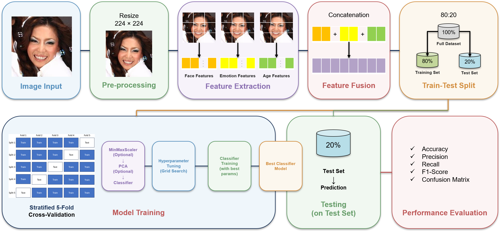

# Paper Outline Terperinci - IEEE Access / Q1 Journal

> **Target Publikasi**: Artikel Jurnal Internasional Bereputasi (IEEE Access / Pattern Recognition / Image and Vision Computing)  
> **Bahasa Naskah**: Bahasa Indonesia formal dengan istilah akademik/teknis tetap dalam Bahasa Inggris  
> **Gaya Sitasi**: IEEE format (sitasi teks berbasis nama penulis dan judul tanpa penomoran numerik dulu)  
> **Topik Riset**: Klasifikasi Ras & Gender Interseksional (6-Kelas) Berbasis Fusi Fitur Tri-Domain Vision Transformer dan Support Vector Classifier Teroptimasi

---

## 0. Global Writing Rules and Claim Boundaries

### A. Allowed Claims and Core Focus
1. **Fokus Utama**: Evaluasi empiris sistematis fusi fitur representasi laten dari tiga domain wajah komplementer (Face Identity, Facial Emotion, dan Facial Age) menggunakan Vision Transformer pra-latih (offline feature extraction) dipadukan dengan optimasi pipeline classical machine learning (GridSearchCV 5-Fold Stratified CV).
2. **Klaim Keunggulan Tri-Domain**: Konkatenasi tri-domain (2.304 dimensi) mengungguli representasi domain tunggal (single-domain) dan dual-domain pada 3 dari 4 classifier (SVM, Logistic Regression, Gaussian Naive Bayes), dengan model terbaik **SVM Tri-Domain** mencapai akurasi **93.70%** dan Macro F1 **0.9369** pada dataset benchmark DemogPairs (N=2.160 data uji).
3. **Keadilan Interseksional (Intersectional Fairness)**: Fusi tri-domain secara signifikan mereduksi disparitas performa lintas-subkelompok (F1-Score seluruh 6 kelas berada di atas 0.91, dengan rentang 0.9174 s.d. 0.9614).
4. **Metodologi Bersih & Zero Leakage**: Penskalaan (Scaler) dan reduksi dimensi (PCA) dipelajari secara ketat hanya dari fold latih dalam 5-Fold Cross-Validation, serta evaluasi akhir dilakukan pada subset uji held-out yang belum pernah dilihat selama proses pelatihan.
5. **Gaya Penulisan**: Dilarang keras menggunakan karakter em dash (tanda pisah panjang); gunakan tanda pisah biasa (- atau --), tanda kurung ( ), atau koma (,).

### B. Negative Constraints and Disallowed Claims
1. **Jangan mengklaim model siap untuk penegakan hukum atau pengawasan publik tanpa pengawasan etis**. Wajib disertakan batasan etika AI (ethical statement).
2. **Jangan mengklaim fusi fitur bersifat optimal global mutlak**, melainkan "best-performing configuration identified through systematic hyperparameter grid search within the evaluated search space".
3. **Jangan mengklaim bahwa XGBoost diuji pada benchmark akhir**. Jelaskan secara jujur bahwa XGBoost dieliminasi pada fase eksplorasi awal karena batasan komputasi GPU / inkompatibilitas CUDA pada environment lokal dan efisiensi waktu pelatihan.
4. **Jangan membuat generalisasi ke seluruh ras di dunia**, karena DemogPairs secara spesifik berfokus pada 3 kelompok ras makro (Asian, Black, White).

### C. Equation Plan and Mathematical Notation
- **Ekstraksi ViT**: Formulasi sequence token $z_0 = [x_{\text{class}}; x_p^1 \mathbf{E}; \dots; x_p^N \mathbf{E}] + \mathbf{E}_{pos}$, multi-head self-attention (MHSA), dan ekstraksi token khusus [CLS] sebagai vektor representasi $\mathbf{f} \in \mathbb{R}^{768}$.
- **Fusi Fitur (Concatenation)**: $\mathbf{z}_{\text{tri}} = [\mathbf{f}_{\text{face}} \,\|\, \mathbf{f}_{\text{emotion}} \,\|\, \mathbf{f}_{\text{age}}] \in \mathbb{R}^{2304}$.
- **Pipeline Transformasi**: Standarisasi $\tilde{\mathbf{z}} = \text{Scaler}(\mathbf{z})$ dan Proyeksi PCA $\hat{\mathbf{z}} = \mathbf{W}_{\text{PCA}}^T (\tilde{\mathbf{z}} - \boldsymbol{\mu})$.
- **Optimasi SVM (Kernel Poly Derajat 2)**: $K(\mathbf{x}_i, \mathbf{x}_j) = (\gamma \langle \mathbf{x}_i, \mathbf{x}_j \rangle + r)^d$ dengan $d=2$, fungsi objektif dual cembung dengan batas regularisasi $C=10$.
- **Metrik Evaluasi**: Formulasi Accuracy global, Macro Precision, Macro Recall, Macro F1-Score, serta One-vs-Rest (OvR) Accuracy per-kelas $\text{OvR Acc}_c = \frac{TP_c + TN_c}{N}$.
- **Disiplin Simbol Sederhana**: Penulisan ukuran dimensi (224 × 224), operasi aritmetika (768 + 768 + 768 = 2304), rasio (80/20, 3 Ras × 2 Gender), dan rentang (±5%) wajib menggunakan teks biasa tanpa math mode.

---

## Front Matter

### Paper Title
**Intersectional Face Race and Gender Classification via Tri-Domain Vision Transformer Feature Fusion and Optimized Support Vector Classifier**  
*(Alternatif: Multi-Domain Vision Transformer Fusion for Fair and Accurate Intersectional Demographic Classification from Facial Images)*

### Authors & Affiliation
1. **Dr. Ir. Ricky Eka Putra, S.Kom., M.Kom.** ([ORCID](https://orcid.org/0000-0002-5515-7967)) - *Department of Informatics, Faculty of Informatics, Universitas Negeri Surabaya, Surabaya, Indonesia* (Corresponding Author: `rickyeka@unesa.ac.id`)
2. **Rezky Arisanti Putri, S.Kom., M.Kom.** ([ORCID](https://orcid.org/0009-0000-8021-1833)) - *Department of Informatics, Faculty of Informatics, Universitas Negeri Surabaya, Surabaya, Indonesia*
3. **Dr. Yuni Yamasari, S.Kom., M.Kom.** ([ORCID](https://orcid.org/0000-0001-9719-3491)) - *Department of Informatics, Faculty of Informatics, Universitas Negeri Surabaya, Surabaya, Indonesia*
4. **Rafy Aulia Akbar, S.Kom., M.Kom.** ([ORCID](https://orcid.org/0009-0003-6991-0694)) - *Department of Informatics, Faculty of Informatics, Universitas Negeri Surabaya, Surabaya, Indonesia*

### Abstract
Satu paragraf terpadu, **target 150-200 kata**, dengan alur: **Latar Belakang → Tujuan Penelitian → Metode yang Diusulkan → Hasil Eksperimen → Kesimpulan**.
- **Latar Belakang**: Pengenalan atribut demografis wajah (ras dan gender) secara simultan menghadapi tantangan variasi ekspresi dinamis, degradasi morfologi penuaan biologis, tumpang tindih visual (phenotypic overlap), dan bias representasi domain tunggal.
- **Tujuan**: Mengusulkan kerangka kerja fusi fitur laten lintas-domain (cross-domain feature fusion) dari tiga Vision Transformer (ViT-Base) pra-latih yang menangkap domain identitas, emosi, dan usia dipadukan dengan optimasi pipeline classical classifiers untuk klasifikasi interseksional 6-kelas.
- **Metode**: 10.800 citra wajah benchmark DemogPairs (seimbang sempurna pada 3 Ras × 2 Gender) diekstraksi secara offline (one-pass) dari token [CLS] (768-d per domain). Sebanyak 7 skema ablasi fitur (768-d, 1.536-d, dan 2.304-d) diuji melalui GridSearchCV 5-Fold Stratified Cross-Validation (1.086 kombinasi, total 38.010 fits) pada empat classifier (SVM, Logistic Regression, Random Forest, Gaussian Naive Bayes).
- **Hasil**: SVM Tri-Domain ($C=10$, kernel polinomial derajat 2, tanpa PCA/Scaler) meraih performa terbaik dengan **akurasi 93.70%** dan **Macro F1 0.9369** pada 2.160 data uji held-out. F1-Score pada seluruh 6 subkelompok berada di atas 91% (0.9174-0.9614).
- **Kesimpulan**: Fusi tri-domain terbukti efektif mengatasi keterbatasan representasi domain tunggal, mengeliminasi bias demografis, dan menghasilkan klasifikasi interseksional yang akurat dan adil.

### Keywords
Facial demographic recognition; intersectional classification; Vision Transformer; multi-domain feature fusion; algorithmic fairness; Support Vector Machine; DemogPairs.

---

## I. INTRODUCTION

Introduction disusun dalam 7 paragraf berbobot dengan alur narasi yang kohesif:

```
[Paragraph 1: Urgensi Demografis Wajah & Isu Bias Sosial]
                    │
                    ▼
[Paragraph 2: Formulasi Klasifikasi Interseksional 6-Kelas]
                    │
                    ▼
[Paragraph 3: Perkembangan Metode & Vision Transformers (Daftar Paper)]
                    │
                    ▼
[Paragraph 4: Kesenjangan Riset (Research Gaps)]
                    │ (Transisi Mulus / Kohesif)
                    ▼
[Paragraph 5: Usulan Solusi: Kerangka Kerja Tri-Domain ViT]
                    │
                    ▼
[Paragraph 6: Empat Kontribusi Utama Penelitian]
                    │
                    ▼
[Paragraph 7: Organisasi Artikel]
```

### Paragraph 1: Demographic Face Recognition and Algorithmic Bias
- **Target Kata**: 150 kata (minimal 150 kata, maksimal 150 kata).
- **Tujuan**: Menjelaskan urgensi analisis atribut demografis wajah (ras dan gender) pada sistem visi komputer modern serta memaparkan tantangan kritis disparitas performa (algorithmic bias) terhadap kelompok minoritas.
- **Poin Narasi**:
  1. Pengenalan otomatis atribut demografis wajah memegang peranan krusial pada forensik digital, kontrol akses biometrik, interaksi manusia-komputer, dan personalisasi layanan cerdas.
  2. Sistem visi komputer komersial dan akademik sering kali memperlihatkan bias performa sistemik, di mana akurasi klasifikasi menurun tajam pada kelompok wanita dan populasi berkulit gelap.
  3. Ketimpangan ini bersumber dari distribusi data latih publik yang tidak seimbang serta kegagalan ekstraktor fitur konvensional dalam menangkap ciri representatif yang invarian terhadap variasi visual wajah liar.
- **Transisi**: Keterbatasan penanganan bias ini menuntut formulasi pengenalan atribut demografis yang memodelkan interaksi ras dan gender secara bersamaan.

### Paragraph 2: From Isolated Tasks to Intersectional Classification
- **Target Kata**: 150 kata (minimal 150 kata, maksimal 150 kata).
- **Tujuan**: Menjelaskan transisi dari klasifikasi atribut terisolasi (ras saja atau gender saja) menuju klasifikasi interseksional terpadu (3 Ras × 2 Gender = 6 kelas).
- **Poin Narasi**:
  1. Sebagian besar literatur memformulasikan pengenalan ras dan gender sebagai dua tugas terpisah yang independen.
  2. Pendekatan terisolasi mengabaikan dependensi silang (cross-attribute dependencies) dan gagal mendeteksi bias interseksional tersembunyi yang terkonsentrasi pada persilangan subgrup tertentu (seperti Black Females atau Asian Females).
  3. Formulasi 6-kelas interseksional terpadu (`Asian_Females`, `Asian_Males`, `Black_Females`, `Black_Males`, `White_Females`, `White_Males`) pada dataset seimbang sempurna memberikan landasan audit keadilan yang objektif dan komprehensif.
- **Transisi**: Keberhasilan klasifikasi interseksional bergantung langsung pada kemampuan arsitektur ekstraksi representasi visual wajah.

### Paragraph 3: Recent Architectural Advances and Vision Transformers
- **Target Kata**: 180-250 kata (paragraf khusus pembahasan penelitian sebelumnya).
- **Tujuan**: Memberikan konteks perkembangan pendekatan arsitektur dari CNN konvensional ke Vision Transformers serta metode pendukung lainnya dalam pengenalan atribut wajah.
- **Poin Narasi**:
  1. Pendekatan klasik berbasis fitur buatan tangan (handcrafted features: LBP, HOG, SIFT) dan arsitektur Convolutional Neural Networks (CNN: VGG, ResNet, Xception) terbatas oleh reseptif lokal yang kesulitan memodelkan relasi spasial global wajah jarak jauh.
  2. Kemunculan Vision Transformer (ViT) dengan mekanisme Multi-Head Self-Attention (MHSA) membawa lompatan paradigma dengan memodelkan interaksi antar-patch secara holistik dan menyandikan bias sosial laten yang lebih rendah.
  3. Berbagai variasi arsitektur telah dikembangkan, mulai dari model berbasis wilayah wajah tengah, pembelajaran multi-tugas multi-skala, modul atensi paralel, hingga teknik mitigasi bias generatif dan transformer multi-aksis.
- **Daftar Sitasi Wajib Berdasarkan Judul Paper pada Related Works**:
  1. *Automatic Ethnicity Classification from Middle Part of the Face Using Convolutional Neural Networks* (Belcar et al., Sensors 2022)
  2. *Face Gender and Age Classification Based on Multi-Task, Multi-Instance and Multi-Scale Learning* (Liao et al., Applied Sciences 2022)
  3. *Intelligent deep learning based ethnicity recognition and classification using facial images* (Sunitha et al., Image and Vision Computing 2022)
  4. *A Multidimensional Analysis of Social Biases in Vision Transformers* (Brinkmann et al., ICCV 2023)
  5. *Deep Generative Views to Mitigate Gender Classification Bias Across Gender-Race Groups* (Ramachandran & Rattani, Springer / ICPR Workshops 2023)
  6. *Learning an attention-aware parallel sharing network for facial attribute recognition* (Chen et al., JVCI 2023)
  7. *Classifying Gender Based on Face Images Using Vision Transformer* (Tahyudin et al., JOIV 2024)
  8. *Ethnicity Classification Based on Facial Images using Deep Learning Approach* (Kalkatawi & Saeed, IJACSA 2024)
  9. *Dual Vision Transformer Integration for Race and Gender Recognition Based on Facial Images* (Putri et al., IEEE ICVEE 2025)
  10. *MD-ViT: Multidomain Vision Transformer Fusion for Fair Demographic Attribute Recognition* (Putri et al., JIEET 2025)
- **Transisi**: Meskipun model berbasis transformer berkembang pesat, analisis kritis terhadap literatur mengungkap beberapa kesenjangan mendasar yang belum terpecahkan.

### Paragraph 4: Research Gaps in Facial Demographic Recognition
- **Target Kata**: 150 kata (minimal 150 kata, maksimal 150 kata).
- **Tujuan**: Merumuskan kesenjangan riset utama (research gaps) yang mengaitkan keterbatasan representasi domain tunggal, kerentanan penuaan, dan kelemahan classifier hilir.
- **Poin Narasi**:
  1. *Keterbatasan Domain Tunggal*: Mayoritas model hanya mengandalkan fitur biometrik identitas murni, sehingga rentan terhadap variasi ekspresi dinamis dan tumpang tindih visual (phenotypic overlap).
  2. *Distorsi Usia Ekstrem*: Pengenalan demografis mengalami tingkat kegagalan tinggi pada kelompok usia anak-anak dan lansia karena ketiadaan fitur invarian penuaan.
  3. *Kelemahan Classifier End-to-End*: Lapisan SoftMax berbasis gradient descent rentan mengalami overfitting pada embedding berdimensi tinggi, sementara studi eksplorasi classifier klasik sebelumnya terbatas pada ruang hyperparameter sempit tanpa menguji interaksi penskalaan (scaling) dan reduksi PCA secara sistematis.
- **Transisi Kohesif ke Usulan Solusi**: Untuk mengatasi keterbatasan representasi domain tunggal dan kelemahan optimasi batas keputusan tersebut, penelitian ini mengusulkan integrasi tiga domain representasi Vision Transformer yang dipadukan dengan optimasi pipeline classical classifier terstruktur.

### Paragraph 5: Proposed Multi-Domain Feature Fusion Framework
- **Target Kata**: 180-250 kata (paragraf khusus usulan solusi).
- **Tujuan**: Memaparkan kerangka kerja usulan yang menjawab seluruh kesenjangan riset pada Paragraf 4 secara komprehensif dan sistematis.
- **Poin Narasi**:
  1. Mengusulkan kerangka kerja fusi fitur Tri-Domain Vision Transformer yang mengombinasikan tiga domain komplementer: `ViT-Face` (geometri biometrik statis), `ViT-Emotion` (dinamika mikro-otot afektif), dan `ViT-Age` (morfologi tekstur penuaan biologis) menjadi representasi padat 2.304 dimensi.
  2. Ekstraksi fitur dilakukan secara offline (one-pass) dari token [CLS] (768-d per domain) untuk menjaga efisiensi dan mengisolasi variabilitas komputasi.
  3. Representasi laten dievaluasi melalui 7 konfigurasi ablasi fitur pada empat algoritma classical machine learning (SVM, Logistic Regression, Random Forest, Gaussian Naive Bayes).
  4. Optimasi hyperparameter dilakukan melalui GridSearchCV 5-Fold Stratified Cross-Validation (1.086 kombinasi, total 38.010 fits) dengan pipeline modular Scaler-PCA yang menjamin protokol zero-leakage.
- **Transisi**: Pendekatan metodologis terpadu ini menghasilkan empat kontribusi ilmiah utama.

### Paragraph 6: Key Contributions
- **Target Kata**: 200-250 kata (paragraf khusus kontribusi utama).
- **Tujuan**: Menyajikan empat kontribusi ilmiah penelitian secara eksplisit, bernomor, dan berbasis bukti empiris:
- **Poin Narasi**:
  1. **A novel Tri-Domain Vision Transformer feature fusion framework** integrating facial identity geometry (ViT-Face), dynamic micro-expressions (ViT-Emotion), and biological aging morphology (ViT-Age) into a rich 2,304-dimensional representation for intersectional demographic classification.
  2. **An exhaustive empirical benchmark across 28 experimental configurations** (7 feature ablation schemes × 4 classical classifiers) optimized via 5-Fold Stratified GridSearchCV exploring 1,086 hyperparameter combinations (38,010 cross-validation fits), establishing an optimal non-linear decision boundary via Support Vector Classifier ($C=10$, degree-2 polynomial kernel).
  3. **State-of-the-art performance on the DemogPairs benchmark**, achieving **93.70% test accuracy** and **0.9369 Macro F1**, outperforming prior single-domain and dual-domain baselines.
  4. **A rigorous intersectional fairness audit** demonstrating near-zero performance disparity across all 6 demographic subgroups (F1-Scores strictly bounded within 0.9174-0.9614 and One-vs-Rest accuracy reaching 97.31%-98.70%), proving that multi-domain fusion effectively mitigates demographic classification bias without trade-offs.
- **Transisi**: Setelah menjabarkan kontribusi, batasi ruang lingkup dan jelaskan organisasi penulisan artikel.

### Paragraph 7: Paper Organization
- **Target Kata**: 80-110 kata (paragraf khusus organisasi paper).
- **Tujuan**: Menjelaskan sistematika dan fungsi setiap bab dalam artikel.
- **Poin Narasi**:
  Artikel ini disusun sebagai berikut: Section II mengulas sintesis literatur terkait (Related Works); Section III menjabarkan dataset, metodologi ekstraksi multi-domain ViT, dan pipeline optimasi GridSearchCV (Materials and Methods); Section IV memaparkan analisis komparatif 28 eksperimen, studi ablasi, audit keadilan, dan perbandingan dengan studi terdahulu (Results and Discussion); Section V menyimpulkan temuan utama, keterbatasan, dan arah penelitian mendatang (Conclusion and Future Work).

---

## II. RELATED WORKS

Sintesis literatur disusun dalam 6 paragraf terstruktur tanpa subjudul, masing-masing dengan target jumlah kata yang terukur:

### Paragraph 1: Facial Attribute and Demographic Recognition
- **Target Kata**: 150 kata (minimal 150 kata, maksimal 150 kata).
- **Fokus Sintesis**: Evolusi tugas pengenalan ras dan gender wajah dari deskriptor konvensional berbasis bagian (part-based) dan fitur buatan tangan (handcrafted features: LBP, HOG, Gabor) ke model representasi mendalam holistik. Menjelaskan keterbatasan model konvolusional klasik terhadap distorsi pencahayaan liar dan efek bias lintas-populasi (Other-Race Effect).
- **Sumber Literatur Terkait**:
  - *Automatic Ethnicity Classification from Middle Part of the Face Using Convolutional Neural Networks* (Belcar et al., Sensors 2022)
  - *Intelligent deep learning based ethnicity recognition and classification using facial images* (Sunitha et al., IVC 2022)
  - *Learning an attention-aware parallel sharing network for facial attribute recognition* (Chen et al., JVCI 2023)

### Paragraph 2: Vision Transformers for Face Representation
- **Target Kata**: 150 kata (minimal 150 kata, maksimal 150 kata).
- **Fokus Sintesis**: Penerapan arsitektur Vision Transformer (ViT) dalam analisis biometrik wajah. Menjelaskan bagaimana mekanisme Multi-Head Self-Attention (MHSA) global mampu menangkap keterkaitan struktural antar-komponen wajah secara menyeluruh melampaui operasi konvolusi lokal CNN, serta pemanfaatan model transformer hibrida seperti MaxViT.
- **Sumber Literatur Terkait**:
  - *A Multidimensional Analysis of Social Biases in Vision Transformers* (Brinkmann et al., ICCV 2023)
  - *Classifying Gender Based on Face Images Using Vision Transformer* (Tahyudin et al., JOIV 2024)
  - *Ethnicity Classification Based on Facial Images using Deep Learning Approach* (Kalkatawi & Saeed, IJACSA 2024)

### Paragraph 3: Social Bias and Algorithmic Fairness in Vision Systems
- **Target Kata**: 150 kata (minimal 150 kata, maksimal 150 kata).
- **Fokus Sintesis**: Analisis kritis terhadap fenomena bias sosial dalam representasi laten model visi dan teknik mitigasi bias. Menyoroti temuan bahwa model ViT diskriminatif secara inheren lebih adil dibanding model generatif, pentingnya dataset yang berimbang sempurna untuk mencegah bias representasi, serta trade-off akurasi-keadilan pada metode augmentasi generatif seperti StyleGAN2.
- **Sumber Literatur Terkait**:
  - *A Multidimensional Analysis of Social Biases in Vision Transformers* (Brinkmann et al., ICCV 2023)
  - *Deep Generative Views to Mitigate Gender Classification Bias Across Gender-Race Groups* (Ramachandran & Rattani, Springer 2023)
  - *Classifying Gender Based on Face Images Using Vision Transformer* (Tahyudin et al., JOIV 2024)

### Paragraph 4: Multi-Domain and Multi-Task Feature Fusion
- **Target Kata**: 150 kata (minimal 150 kata, maksimal 150 kata).
- **Fokus Sintesis**: Perkembangan pendekatan fusi representasi multi-skala, multi-task, dan multi-domain pada analisis atribut wajah. Mengulas keterbatasan representasi domain tunggal dalam mengakomodasi interaksi kompleks antara geometri identitas, ekspresi mikro, dan penuaan wajah, serta pentingnya penggabungan fitur laten ortogonal.
- **Sumber Literatur Terkait**:
  - *Face Gender and Age Classification Based on Multi-Task, Multi-Instance and Multi-Scale Learning* (Liao et al., Applied Sciences 2022)
  - *Learning an attention-aware parallel sharing network for facial attribute recognition* (Chen et al., JVCI 2023)
  - *Deep Generative Views to Mitigate Gender Classification Bias Across Gender-Race Groups* (Ramachandran & Rattani, Springer 2023)

### Paragraph 5: Downstream Classifier Paradigms and Decision Boundaries
- **Target Kata**: 150 kata (minimal 150 kata, maksimal 150 kata).
- **Fokus Sintesis**: Perbandingan paradigma classifier hilir antara SoftMax end-to-end, algoritma Kernel Extreme Learning Machine (KELM), model ensemble pohon (Decision Forest / XGBoost), dan Support Vector Machine (SVM). Menjelaskan keunggulan optimasi margin cembung global SVM non-linear dalam memetakan batas keputusan pada ruang laten berdimensi tinggi tanpa terjebak local minima.
- **Sumber Literatur Terkait**:
  - *Automatic Ethnicity Classification from Middle Part of the Face Using Convolutional Neural Networks* (Belcar et al., Sensors 2022)
  - *Intelligent deep learning based ethnicity recognition and classification using facial images* (Sunitha et al., IVC 2022)
  - *Face Gender and Age Classification Based on Multi-Task, Multi-Instance and Multi-Scale Learning* (Liao et al., Applied Sciences 2022)
  - *Ethnicity Classification Based on Facial Images using Deep Learning Approach* (Kalkatawi & Saeed, IJACSA 2024)

### Paragraph 6: Precursor Studies and Research Positioning
- **Target Kata**: 150 kata (minimal 150 kata, maksimal 150 kata).
- **Fokus Sintesis**: Memetakan posisi strategis dan kebaruan penelitian ini terhadap dua studi prekursor tim: integrasi Dual-ViT Face+Emotion via SVM pada IEEE ICVEE 2025 dan MD-ViT Face+Age via XGBoost pada JIEET 2025. Menegaskan bahwa penelitian ini menyempurnakan paradigma dengan menggabungkan ketiga domain secara simultan (Face+Emotion+Age: 2.304-d) dipadukan dengan eksplorasi 1.086 kombinasi GridSearchCV untuk mencapai akurasi state-of-the-art dan keadilan interseksional tertinggi.
- **Sumber Literatur Terkait**:
  - *Dual Vision Transformer Integration for Race and Gender Recognition Based on Facial Images* (Putri et al., IEEE ICVEE 2025)
  - *MD-ViT: Multidomain Vision Transformer Fusion for Fair Demographic Attribute Recognition* (Putri et al., JIEET 2025)

---

## III. MATERIALS AND METHODS

### Overview
- **Target Kata**: 150 kata (minimal 150 kata, maksimal 150 kata).
- **Tujuan**: Menjelaskan arsitektur keseluruhan kerangka kerja penelitian yang diusulkan (end-to-end framework) dari masukan citra wajah mentah, pemisahan partisi data, ekstraksi fitur tri-domain ViT offline, fusi konkatenasi, hingga pipeline optimasi GridSearchCV classical classifier.
- **Sitasi Gambar Wajib**: Mensitasi diagram metode keseluruhan yang tersimpan pada file `images/method.png`.
- **Caption Figure**: **Figure 1. End-to-End Framework of the Proposed Multi-Domain Vision Transformer Feature Fusion and Classical Classifier Optimization for Intersectional Race and Gender Classification.**
- **Visual Markdown**:
  
- **Narasi Pendukung**: Menjelaskan alur pemrosesan: citra wajah berukuran 224 × 224 piksel dialirkan ke tiga model ViT-Base pra-latih yang dibekukan (frozen), vektor token [CLS] 768-d diekstraksi secara offline, digabungkan menjadi vektor fusi 2.304-d, diproses melalui pipeline modular Scaler-PCA, dan diklasifikasikan ke dalam 6 kelas interseksional melalui 5-Fold Stratified Cross-Validation.

### A. Dataset
- **Target Kata**: 150 kata (minimal 150 kata, maksimal 150 kata).
- **Spesifikasi**: Dataset **DemogPairs** (*DemogPairs: Quantifying the Impact of Demographic Imbalance in Deep Face Recognition*, Hupont & Fernández, IEEE FG 2019).
- **Karakteristik Data**: 10.800 citra wajah (600 identitas unik × 18 citra per subjek), seimbang sempurna pada 6 kelas interseksional (1.800 citra per kelas).
- **Tabel I**: Komposisi Kelas DemogPairs (Indeks 0-5, Ras, Gender, Subjek, Total Citra, Pembagian Train 8.640 dan Test 2.160).
- **Protokol Partisi**: Stratified 80/20 Split (`random_state=42`, `stratify=y`) yang diterapkan secara identik untuk seluruh 28 eksperimen tanpa re-splitting, menjamin zero data leakage.

### B. Image Preprocessing and Multi-Domain ViT Feature Extraction
- **Target Kata**: 150 kata (minimal 150 kata, maksimal 150 kata).
- **Tahap Preprocessing**: Konversi citra ke 3-channel RGB, interpolasi bicubic ke resolusi 224 × 224 piksel, rescaling $[0, 255] \to [0, 1]$, dan standardisasi channel-wise $(x - \mu)/\sigma$ spesifik per model processor.
- **Tiga Domain Ekstraktor ViT-Base (12 Layers, 12 Heads, 768 Hidden Dim, Patch 16 × 16)**:
  1. `ViT-Face` (`skutaada/VIT-VGGFace`): Menangkap geometri biometrik statis (kontur rahang, proporsi kraniofasial).
  2. `ViT-Emotion` (`dima806/facial_emotions_image_detection`): Menangkap dinamika mikro afektif dan Action Units otot wajah.
  3. `ViT-Age` (`dima806/facial_age_image_detection`): Menangkap tekstur penuaan biologis dan elastisitas kulit.
- **Formulasi Ekstraksi Token [CLS]**:
  $$\mathbf{z}_0 = [\mathbf{x}_{\text{class}}; \, \mathbf{x}_p^1\mathbf{E}; \, \dots; \, \mathbf{x}_p^{196}\mathbf{E}] + \mathbf{E}_{\text{pos}}$$
  $$\mathbf{f}_{\text{domain}} = \text{LayerNorm}(\mathbf{z}_L^0) \in \mathbb{R}^{768}$$

### C. Feature Fusion and Ablation Design
- **Target Kata**: 150 kata (minimal 150 kata, maksimal 150 kata).
- **Mekanisme Fusi**: Konkatenasi vektor berurutan secara alfabetis:
  $$\mathbf{z}_{\text{single}} \in \mathbb{R}^{768}, \quad \mathbf{z}_{\text{dual}} = [\mathbf{f}_a \,\|\, \mathbf{f}_b] \in \mathbb{R}^{1536}, \quad \mathbf{z}_{\text{tri}} = [\mathbf{f}_{\text{face}} \,\|\, \mathbf{f}_{\text{emotion}} \,\|\, \mathbf{f}_{\text{age}}] \in \mathbb{R}^{2304}$$
- **Tabel II**: Matriks 7 konfigurasi ablasi fitur (3 Single-domain 768-d, 3 Dual-domain 1.536-d, 1 Tri-domain 2.304-d).

### D. Classification Pipeline and Hyperparameter Optimization
- **Target Kata**: 150 kata (minimal 150 kata, maksimal 150 kata).
- **Arsitektur Pipeline Modular**: $\mathbf{x} \xrightarrow{\text{Scaler}} \tilde{\mathbf{x}} \xrightarrow{\text{PCA}} \hat{\mathbf{x}} \xrightarrow{\text{Classifier}} \hat{y} \in \{0, 1, 2, 3, 4, 5\}$.
- **Ruang Pencarian GridSearchCV (1.086 Kombinasi / Fitur)**:
  - **SVM (288)**: Scaler (2) × PCA (3) × $C \in \{0.1, 1, 10, 100\}$ × kernel $\in \{\text{'linear'}, \text{'rbf'}, \text{'poly'}\}$ × degree $\in \{2, 3\}$ × gamma $\in \{\text{'scale'}, \text{'auto'}\}$.
  - **Logistic Regression (270)**: Scaler (2) × PCA (3) × $C \in \{0.01, 0.1, 1, 10, 100\}$ × solver $\in \{\text{'lbfgs'}, \text{'saga'}, \text{'newton-cg'}\}$ × max_iter $\in \{200, 500, 2000\}$.
  - **Random Forest (288)**: Scaler (2) × PCA (3) × n_estimators $\in \{100, 200\}$ × max_depth $\in \{\text{None}, 10, 30\}$ × max_features $\in \{\text{'sqrt'}, \text{'log2'}\}$ × min_samples_split $\in \{2, 5\}$ × min_samples_leaf $\in \{1, 2\}$.
  - **Gaussian Naive Bayes (240)**: Scaler (2) × PCA (3) × var_smoothing $\in \text{logspace}(-9, 2, 40)$.
- **Validasi Silang**: 5-Fold Stratified CV (`shuffle=True, random_state=42`), scoring multi-metrik, `refit='accuracy'`. Total komputasi 38.010 fits.

### E. Evaluation Metrics and Algorithmic Fairness Formulations
- **Target Kata**: 150 kata (minimal 150 kata, maksimal 150 kata).
- **Metrik Global**:
  $$\text{Accuracy} = \frac{\sum_{c=1}^6 TP_c}{N}, \quad \text{Macro F1} = \frac{1}{6} \sum_{c=1}^6 \frac{2 \cdot \text{Prec}_c \cdot \text{Rec}_c}{\text{Prec}_c + \text{Rec}_c}$$
- **Metrik One-vs-Rest (OvR) per Subkelompok**:
  $$\text{OvR Acc}_c = \frac{TP_c + TN_c}{N}, \quad \text{Rec}_c = \frac{TP_c}{TP_c + FN_c}, \quad \text{Prec}_c = \frac{TP_c}{TP_c + FP_c}$$
- **Metrik Disparitas Keadilan**: $\Delta_{\text{Recall}} = \max(\text{Rec}) - \min(\text{Rec})$ dan $\Delta_{\text{F1}} = \max(\text{F1}) - \min(\text{F1})$.

---

## IV. RESULTS AND DISCUSSION

### A. Global Performance Benchmark across 28 Experiments
- **Target Kata**: 150 kata (minimal 150 kata, maksimal 150 kata).
- **Tabel III**: Hasil komparasi 28 eksperimen (Rank 1-28, Classifier, Fitur, Dimensi, Akurasi, Precision, Recall, F1, Best Parameters).
- **Poin Kunci**:
  - Juara global: **SVM Tri-Domain** (0.9370 / 0.9369 Macro F1).
  - Runner-up: **SVM Dual vit-emotion-face** (0.9329) dan **LR Tri-Domain** (0.9273).
  - Rata-rata performa classifier: $\text{SVM } (0.9147) > \text{LR } (0.9040) > \text{RF } (0.8281) > \text{GNB } (0.7937)$.

### B. Multi-Domain Feature Ablation and Synergy Analysis
- **Target Kata**: 150 kata (minimal 150 kata, maksimal 150 kata).
- **Kuantifikasi Dampak Fusi**:
  - *Single → Dual*: `vit-face` (0.9083) → `vit-emotion-face` (0.9329) $\implies +0.0245$ (reduksi error 26.77%).
  - *Dual → Tri*: `vit-emotion-face` (0.9329) → Tri (0.9370) $\implies +0.0042$.
  - *Single → Tri*: `vit-face` (0.9083) → Tri (0.9370) $\implies +0.0287$ (reduksi error 31.31%).
- **Peran Sinergis ViT-Age**: `vit-face-age` (0.9255) melampaui `vit-face` (0.9083) sebesar $+0.0172$, membuktikan tekstur penuaan biologis memberikan informasi ortogonal yang melengkapi geometri biometrik.
- **Anomali RF**: RF Dual (0.8685) unggul tipis dari RF Tri (0.8620, $-0.0065$) karena keacakan partisi pohon pada dimensi 2.304 (curse of dimensionality).

### C. Intersectional Demographic Fairness and Subgroup Parity
- **Target Kata**: 150 kata (minimal 150 kata, maksimal 150 kata).
- **Tabel IV**: Metrik OvR per-subgrup demografis pada 4 model Tri-Domain.
- **Performa Subgrup Model Juara (SVM Tri-Domain)**:
  - `White_Males`: Recall 0.9694 | F1 0.9614 | OvR Acc 98.70%
  - `Black_Males`: Recall 0.9417 | F1 0.9483 | OvR Acc 98.29%
  - `White_Females`: Recall 0.9472 | F1 0.9355 | OvR Acc 97.82%
  - `Asian_Males`: Recall 0.9444 | F1 0.9341 | OvR Acc 97.78%
  - `Asian_Females`: Recall 0.9250 | F1 0.9250 | OvR Acc 97.50%
  - `Black_Females`: Recall 0.8944 | F1 0.9174 | OvR Acc 97.31%
- **Disparitas Minimal**: Rentang F1 sangat sempit (gap hanya 0.0441), seluruh subgrup >91%. LR Tri mencatat gap Recall terkecil (0.0500).

### D. Confusion Matrix and Error Pattern Analysis
- **Target Kata**: 150 kata (minimal 150 kata, maksimal 150 kata).
- **Tabel V**: Matriks konfusi 6 × 6 aktual (2.160 data uji) dan tabel rincian TP, FP, FN, TN.
- **Temuan Pola Kesalahan**: Kesalahan misklasifikasi terkonsentrasi pada **antar-ras dengan gender yang sama** (misal 16 kasus `Black_Females` diprediksi sebagai `White_Females`), sedangkan kesalahan gender intra-ras atau lintas-ras sangat jarang (<1%).

### E. Support Vector Classifier Decision Boundary Analysis
- **Target Kata**: 150 kata (minimal 150 kata, maksimal 150 kata).
- **Fokus Pembahasan**: Alasan matematis keunggulan SVM kernel polinomial derajat 2 ($C=10$, $\gamma=$ scale, no-PCA, no-Scaler). Pemetaan non-linear kuadratik $\langle \mathbf{x}_i, \mathbf{x}_j \rangle^2$ secara alami menangkap korelasi silang perkalian antar-fitur laten ketiga domain ViT tanpa mendistorsi varians asli data.

### F. Comparative Analysis with Prior Literature
- **Target Kata**: 150 kata (minimal 150 kata, maksimal 150 kata).
- **Tabel VI**: Perbandingan komparatif model usulan terhadap 10 paper literatur (Belcar 2022 [61.74%], Tahyudin 2024 [81.74%], Kalkatawi 2024 [77.20%], Putri et al. ICVEE 2025 [92.41%], Putri et al. JIEET 2025 [89.07%]). Model usulan Tri-Domain SVM meraih performa tertinggi (**93.70%**) dengan tingkat keadilan interseksional paling seimbang.

---

## V. CONCLUSION AND FUTURE WORK

### A. Conclusion
- **Target Kata**: 150 kata (minimal 150 kata, maksimal 150 kata).
- **Poin Kesimpulan**:
  1. Fusi Tri-Domain ViT (Face + Emotion + Age: 2.304-d) terbukti secara konsisten memecahkan limitasi representasi domain tunggal dan memberikan peningkatan akurasi universal.
  2. Support Vector Classifier teroptimasi ($C=10$, kernel poly degree 2) menetapkan standar baru pada DemogPairs dengan akurasi 93.70% dan Macro F1 0.9369.
  3. Fusi multi-domain berhasil memitigasi bias demografis tanpa trade-off, menjaga F1-Score seluruh 6 subkelompok di atas 91%.

### B. Limitations and Future Directions
- **Target Kata**: 150 kata (minimal 150 kata, maksimal 150 kata).
- **Poin Keterbatasan & Riset Lanjutan**:
  1. Dataset saat ini terbatas pada 3 kelompok ras makro (Asian, Black, White); riset lanjutan disarankan menguji populasi multirasial yang lebih variatif (Hispanik, Timur Tengah, Asia Selatan).
  2. Eksplorasi mekanisme fusi atensi adaptif lintas-modal (Cross-Attention Fusion) yang dilatih secara end-to-end.
  3. Penerapan metode interpretasi visual (Explainable AI: Grad-CAM / Attention Rollout) untuk menganalisis kontribusi spasial tiap domain ViT secara visual.

---

## References

- D. Belcar, S. Ribarić, and M. Vrbanovský, "Automatic Ethnicity Classification from Middle Part of the Face Using Convolutional Neural Networks," *Sensors*, vol. 22, no. 15, art. no. 5940, 2022, doi: 10.3390/s22155940.
- M. Liao, S. Yuan, L. Wu, G. Zhong, L. Jin, and H. Xiong, "Face Gender and Age Classification Based on Multi-Task, Multi-Instance and Multi-Scale Learning," *Applied Sciences*, vol. 12, no. 23, art. no. 12432, 2022, doi: 10.3390/app122312432.
- M. Sunitha, P. Geetha, S. Neelakandan, S. Pundir, V. Hemalatha, and M. A. Kumar, "Intelligent deep learning based ethnicity recognition and classification using facial images," *Image and Vision Computing*, vol. 121, art. no. 104404, 2022, doi: 10.1016/j.imavis.2022.104404.
- J. Brinkmann, P. Swoboda, and C. Bartelt, "A Multidimensional Analysis of Social Biases in Vision Transformers," in *Proceedings of the IEEE/CVF International Conference on Computer Vision (ICCV)*, 2023, pp. 4934-4943.
- N. Ramachandran and V. Rattani, "Deep Generative Views to Mitigate Gender Classification Bias Across Gender-Race Groups," in *Pattern Recognition. ICPR 2022 International Workshops and Challenges*, Lecture Notes in Computer Science, Springer, Cham, 2023, pp. 211-226, doi: 10.1007/978-3-031-37742-6_16.
- J. Chen, S. Lai, S. Yan, G. Wang, and X. Zhu, "Learning an attention-aware parallel sharing network for facial attribute recognition," *Journal of Visual Communication and Image Representation*, vol. 90, art. no. 103745, 2023, doi: 10.1016/j.jvcir.2022.103745.
- A. Tahyudin, M. T. Sulistiyo, S. Arzaki, and F. S. Rachmawati, "Classifying Gender Based on Face Images Using Vision Transformer," *International Journal on Informatics Visualization*, vol. 8, no. 1, pp. 18-25, 2024, doi: 10.62527/joiv.8.1.2036.
- K. Kalkatawi and M. Saeed, "Ethnicity Classification Based on Facial Images using Deep Learning Approach," *International Journal of Advanced Computer Science and Applications*, vol. 15, no. 2, pp. 217-226, 2024, doi: 10.14569/IJACSA.2024.0150224.
- R. D. Putri, L. Anifah, R. E. Putra, Y. Yamasari, and R. A. Akbar, "Dual Vision Transformer Integration for Race and Gender Recognition Based on Facial Images," in *2025 8th International Conference on Vocational Education and Electrical Engineering (ICVEE)*, IEEE, 2025, pp. 1-6.
- R. D. Putri, R. E. Putra, and Y. Yamasari, "MD-ViT: Multidomain Vision Transformer Fusion for Fair Demographic Attribute Recognition," *Journal of Information Engineering and Educational Technology (JIEET)*, vol. 9, no. 2, pp. 64-79, 2025.
- I. Hupont and C. Fernández, "DemogPairs: Quantifying the Impact of Demographic Imbalance in Deep Face Recognition," in *2019 14th IEEE International Conference on Automatic Face & Gesture Recognition (FG 2019)*, Lille, France, 2019, pp. 1-7, doi: 10.1109/FG.2019.8756625.
