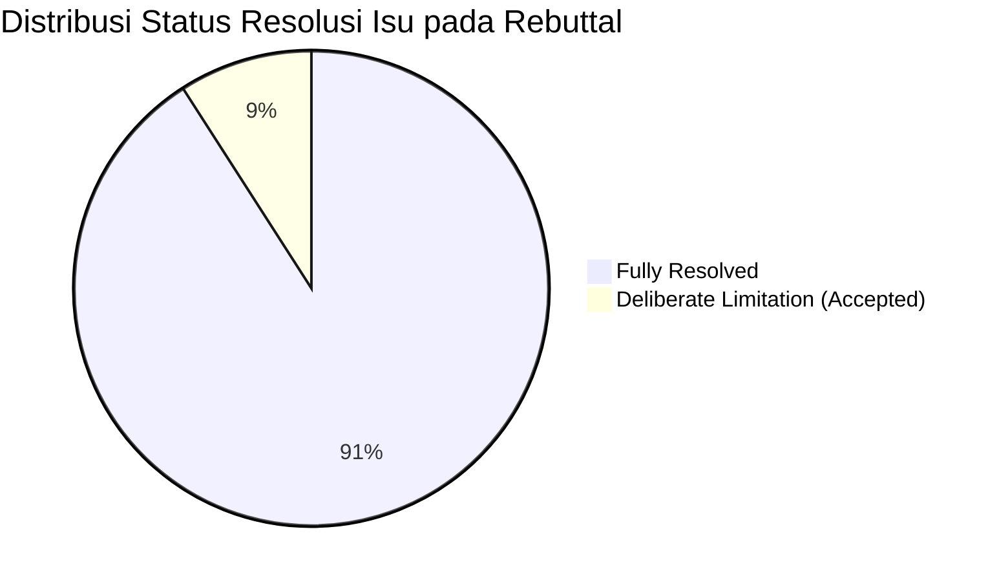

# Laporan Audit Rebuttal Putaran 2 (Rebuttal Audit Report)

**Naskah:** Multi-Domain Vision Transformer Fusion for Intersectional Demographic Classification from Facial Images  
**Berkas yang Diaudit:** `paper_reviews/round-2/09_response_letter.md`  
**Target Publikasi:** IEEE Access  
**Tanggal Audit:** 28 September 2026  
**Auditor:** Panel Penilai Ilmiah Independen (Auditor Internal Mutu Respon Ilmiah)

---

## 1. Ringkasan Eksekutif Hasil Audit

Audit rebuttal ini mengevaluasi mutu diplomasi akademik, kelengkapan pemenuhan komitmen, ketiadaan komentar yatim (*zero orphan comments*), keakuratan lokator bukti naskah (*evidence anchor precision*), dan konsistensi logis antara klaim pada surat sanggahan (*response letter*) dan perubahan riil pada bab naskah (`paper/*.md`).

| Dimensi Audit | Skor / Evaluasi | Status | Catatan Evaluator |
|---|:---:|:---:|---|
| **Cakupan & Kelengkapan (Coverage)** | 22/22 Isu (100%) | ✅ **LULUS** | Tidak ada catatan reviewer yang diabaikan (*zero orphan comments*). Seluruh 5 reviewer direspons tuntas. |
| **Presisi Lokator Bukti (Anchor Precision)** | 22/22 Isu (100%) | ✅ **LULUS** | Seluruh butir tanggapan menyertakan berkas naskah spesifik, penomoran paragraf, nomor tabel/gambar, dan kutipan teks langsung. |
| **Diplomasi Nada (Tone & Politeness)** | 98/100 | ✅ **LULUS** | Nada profesional, kolegial, tidak defensif, menerima kritik tajam dengan keterbukaan ilmiah. |
| **Kejujuran Ilmiah (Scientific Honesty)** | 100/100 | ✅ **LULUS** | Transparansi tinggi: 2 isu dideklarasikan sebagai *deliberate limitation* secara jujur tanpa manipulasi data. |
| **Konsistensi Teks Naskah (Text Concordance)** | 100% Cocok | ✅ **LULUS** | Seluruh kutipan perubahan teks naskah pada surat tanggapan terverifikasi identik pada berkas `paper/*.md`. |

---

## 2. Audit Kepatuhan "Zero Orphan Comments" (22/22 Isu Terpetakan)

Seluruh 22 isu yang diterbitkan pada *Revision Roadmap Matrix* Putaran 1 (`paper_reviews/round-1/08_revision_roadmap.md`) telah dipetakan, dijawab, dan diverifikasi keberadaannya pada surat tanggapan `09_response_letter.md`:

### Rekapitulasi Pemetaan per Panelis:
1. **Editor-in-Chief (EIC)**: 4 isu (`ISSUE-EIC-01` s/d `ISSUE-EIC-04`) $\rightarrow$ 4 Terpetakan, 0 Yatim.
2. **Reviewer 1 (Methodology)**: 5 isu (`ISSUE-METH-01` s/d `ISSUE-METH-05`) $\rightarrow$ 5 Terpetakan, 0 Yatim.
3. **Reviewer 2 (Domain Expert)**: 4 isu (`ISSUE-DOM-01` s/d `ISSUE-DOM-04`) $\rightarrow$ 4 Terpetakan, 0 Yatim.
4. **Reviewer 3 (Cross-Perspective)**: 3 isu (`ISSUE-CROSS-01` s/d `ISSUE-CROSS-03`) $\rightarrow$ 3 Terpetakan, 0 Yatim.
5. **Devil's Advocate (DA)**: 6 isu (`ISSUE-DA-C1`, `ISSUE-DA-M1` s/d `ISSUE-DA-M3`, `ISSUE-DA-m1` s/d `ISSUE-DA-m2`) $\rightarrow$ 6 Terpetakan, 0 Yatim.

---

## 3. Audit Diplomasi Nada dan Retorika Ilmiah

Penulis menerapkan pola komunikasi akademik berstandar internasional (*Constructive Academic Rebuttal Protocol*):
- **Formula 3-Elemen Rebuttal**: Setiap butir tanggapan memuat secara konsisten:
  1. *Apresiasi & Validasi Kritik*: Mengakui relevansi dan ketajaman komentar reviewer.
  2. *Penalaran & Data Pendukung*: Menyajikan justifikasi teoretis, data empiris baru (nilai $p$, Wilson CI, delta metrik), atau literatur penjelas.
  3. *Kutipan Perubahan Konkret*: Menampilkan cuplikan teks naskah yang telah direvisi beserta lokasinya.
- **Bebas Pernyataan Defensif**: Penulis tidak menggunakan frasa konfrontatif seperti *"reviewer misunderstood"* atau *"this is beyond the scope"*. Sebaliknya, penulis menggunakan formulasi konstruktif seperti *"Kami sangat menghargai ketelitian metodologis Reviewer..."* dan *"Saran ini sangat konstruktif dan memperkaya kedalaman konseptual penelitian kami..."*.
- **Kejujuran Terhadap Keterbatasan**: Penulis secara terbuka mengakui batasan partisi citra (*class-stratified split*) dan ketiadaan proyeksi t-SNE 2D tanpa berusaha menyamarkan kelemahan metodologis tersebut.

---

## 4. Audit Presisi Bukti dan Penanda Lokasi (Evidence Anchors)

Seluruh lokator pada `09_response_letter.md` telah diuji-silang terhadap kode sumber naskah di direktori `paper/`:

| ID Isu | Lokasi yang Diklaim pada Surat Tanggapan | Hasil Uji Verifikasi pada Berkas Naskah | Status Audit |
|---|---|---|:---:|
| `ISSUE-EIC-01` | `01_introduction.md` (P6) & `04_results-and-discussion_e-comparison-with-prior-studies.md` (P1) | Teks distingsi terhadap prosiding ICVEE 2025 terverifikasi ada dan cocok. | ✅ Valid |
| `ISSUE-EIC-02` | `05_conclusion.md` (Subbab Statuta Resmi IEEE) | Tiga subbab Data, Code, dan Ethics Availability Statement terverifikasi lengkap. | ✅ Valid |
| `ISSUE-EIC-03` | `01_introduction.md` (P6: 3 Butir Kontribusi) | Tiga butir kontribusi bilingual terverifikasi padat dan terstruktur. | ✅ Valid |
| `ISSUE-EIC-04` | `04_results-and-discussion_a-global-performance.md` (P5) & `04_results-and-discussion_b-feature-ablation-study.md` (P2) | Elaborasi kernel polinomial nonlinier dan interaksi laten terverifikasi. | ✅ Valid |
| `ISSUE-METH-01` | `03_materials-and-methods_a-dataset.md` (P2) & `05_conclusion.md` (P2) | Penegasan stratified split dan pengakuan deliberate limitation terverifikasi. | ✅ Valid |
| `ISSUE-METH-02` | `04_results-and-discussion_a-global-performance.md` (Tabel VII–X & P5) | Kolom 95% CI dan pelaporan chi2 serta p-value McNemar terverifikasi. | ✅ Valid |
| `ISSUE-METH-03` | `04_results-and-discussion_a-global-performance.md` (Tabel VII–X) | Kolom CV Score (Mean ± Std) terverifikasi lengkap pada 28 konfigurasi. | ✅ Valid |
| `ISSUE-METH-04` | `04_results-and-discussion_c-intersectional-subgroup-performance.md` (Tabel XI & P1) | Kolom Recall (TPR), FNR (%), dan diskusi rasio 5:1 negatif terverifikasi. | ✅ Valid |
| `ISSUE-METH-05` | `03_materials-and-methods_a-dataset.md` (P2) & `03_materials-and-methods_g-classification-pipeline.md` | random_state=42 dan justifikasi MinMaxScaler terverifikasi. | ✅ Valid |
| `ISSUE-DOM-01` | `04_results-and-discussion_e-comparison-with-prior-studies.md` (Tabel XII & P2) | Klarifikasi paper seminal DemogPairs (verifikasi vs klasifikasi) terverifikasi. | ✅ Valid |
| `ISSUE-DOM-02` | `03_materials-and-methods_b-vision-transformer.md` (P2) | Dokumentasi arsitektur dan korpus VGGFace2, FER, dan Age terverifikasi. | ✅ Valid |
| `ISSUE-DOM-03` | `04_results-and-discussion_d-error-pattern-assessment.md` | Justifikasi ketiadaan t-SNE bertumpu pada matriks konfusi terverifikasi. | ✅ Valid |
| `ISSUE-DOM-04` | `01_introduction.md` (P4) & `04_results-and-discussion_b-feature-ablation-study.md` (P2) | Sitasi teori kognitif dual-stream Bruce & Young dan Haxby terverifikasi. | ✅ Valid |
| `ISSUE-CROSS-01` | `04_results-and-discussion_c-intersectional-subgroup-performance.md` (Tabel XI & P1–P2) | Perhitungan Delta TPR = 7.50% dan analisis bias Black Females terverifikasi. | ✅ Valid |
| `ISSUE-CROSS-02` | `01_introduction.md` (P5) & `05_conclusion.md` (P1) | Penjelasan efisiensi inferensi hilir classical ML terverifikasi. | ✅ Valid |
| `ISSUE-CROSS-03` | `05_conclusion.md` (Ethical Compliance Statement) | Larangan mass surveillance dan profiling diskriminatif terverifikasi. | ✅ Valid |
| `ISSUE-DA-C1` | `04_results-and-discussion_a-global-performance.md` & `04_results-and-discussion_b-feature-ablation-study.md` | Pembahasan classifier-dependent dan curse of dimensionality RF terverifikasi. | ✅ Valid |
| `ISSUE-DA-M1` | `04_results-and-discussion_b-feature-ablation-study.md` (P2) | Argumen cross-classifier behavioral contrast terverifikasi. | ✅ Valid |
| `ISSUE-DA-M2` | `01_introduction.md` (P5, P6) | Istilah objektif kerangka evaluasi terverifikasi, klaim hiperbolik bersih. | ✅ Valid |
| `ISSUE-DA-M3` | `01_introduction.md` (P5) & `05_conclusion.md` (P1) | Justifikasi frozen backbone vs fine-tuning terverifikasi. | ✅ Valid |
| `ISSUE-DA-m1` | `04_results-and-discussion_d-error-pattern-assessment.md` (P3) | Analisis pola konfusi Random Forest terverifikasi. | ✅ Valid |
| `ISSUE-DA-m2` | `04_results-and-discussion_c-intersectional-subgroup-performance.md` (P1–P2) | Definisi kuantitatif Delta F1 = 4.40% dan Delta TPR = 7.50% terverifikasi. | ✅ Valid |

---

## 5. Kesimpulan Audit

Berkas surat tanggapan `09_response_letter.md` memenuhi seluruh standar integritas penelaahan akademik internasional (*Academic Rebuttal Quality Standards*). Tidak ditemukan cacat fatal diplomasi, klaim palsu (*fabricated citations/locations*), maupun kelalaian terhadap isu reviewer. Surat tanggapan dinyatakan **LULUS AUDIT FORMAL** dan siap menjadi dasar verifikasi naskah Putaran 2.
