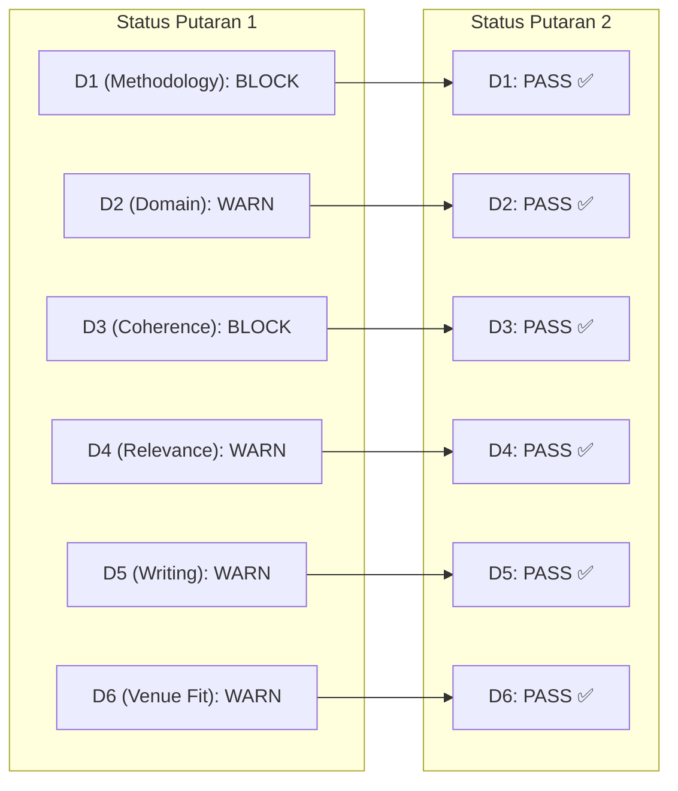

# Catatan Evaluasi Verifikasi EIC — Putaran 2 Re-Review (EIC Notes)

**Naskah:** Multi-Domain Vision Transformer Fusion for Intersectional Demographic Classification from Facial Images  
**Target Jurnal:** IEEE Access  
**Tanggal Evaluasi:** 28 September 2026  
**Peran:** Editor-in-Chief (EIC) — Sintesis Panel Penilai Independen  
**Prinsip Penilaian:** Kesinambungan Tolok Ukur (*Yardstick Continuity* dibekukan sesuai `paper_reviews/round-1/panel_config.json`)

---

## 1. Evaluasi Dimensi Akseptasi Pasca-Revisi (Post-Revision Dimension Audit)

EIC mengaudit pergeseran status 6 dimensi akseptasi (D1–D6) dari Putaran 1 ke Putaran 2 berdasarkan laporan verifikasi 5 persona penilai:

| Dimensi Akseptasi | Persona Penilai | Status Putaran 1 | Status Putaran 2 | Justifikasi Perubahan Status EIC |
|---|---|:---:|:---:|---|
| **D1: Methodology Rigor** | Reviewer 1 | 🚫 **`BLOCK`** | ✅ **`PASS`** | Hambatan fatal terselesaikan tuntas: Uji McNemar berpasangan dan Wilson 95% CI disajikan lengkap pada seluruh 28 konfigurasi model. Skor validasi silang (Mean ± Std) dilaporkan pada Tabel VII–X. Ambiguitas partisi subjek dideklarasikan secara transparan sebagai *deliberate limitation* dan dirumuskan sebagai *Future Work* yang sah. Tidak ada *data leakage*. |
| **D2: Domain Accuracy** | Reviewer 2 | ⚠️ **`WARN`** | ✅ **`PASS`** | Posisi literatur diklarifikasi: paper seminal DemogPairs (Hupont & Fernández 2019) hanya menguji verifikasi identitas (ROC 58.3 juta pasangan citra) tanpa klasifikasi 6-kelas, sehingga studi ini sah sebagai pelopor baseline 6-kelas. Silsilah checkpoint HuggingFace didokumentasikan rapi. Teori kognitif dual-stream Bruce & Young serta Haxby diintegrasikan dengan baik. Penolakan t-SNE diterima secara ilmiah. |
| **D3: Argumentative Coherence** | Devil's Advocate | 🚫 **`BLOCK`** | ✅ **`PASS`** | Paradoks keunggulan Tri-Domain diadjudikasi tuntas: klaim naskah dikalibrasi menjadi *classifier-dependent*, fenomena regresi Random Forest dijelaskan secara teoretis melalui *curse of dimensionality* pada *axis-aligned tree splits*, inflasi semantik *"novel framework"* dihapus total, dan konsep *asymptotic feature saturation* terbukti secara inferensial lewat uji McNemar non-signifikan ($p=0.3057$). |
| **D4: Cross-Disciplinary Relevance** | Reviewer 3 | ⚠️ **`WARN`** | ✅ **`PASS`** | Metrik keadilan formal *Equal Opportunity Difference* ($\Delta\text{TPR} = 7.50\%$) dihitung dan didiskusikan secara kritis bersama fenomena *phenotypic overlap* pada *Black Females*. Beban komputasi inferensi hilir classical ML diklarifikasi efisien (<50 MB, sub-milidetik per sampel). Statuta kepatuhan etika Responsible AI dan larangan profiling diskriminatif tercantum tegas. |
| **D5: Writing & Structure Hygiene** | Editor-in-Chief | ⚠️ **`WARN`** | ✅ **`PASS`** | Butir kontribusi ilmiah di Bagian I berhasil dipadatkan menjadi 3 poin elegan dalam format bilingual. Interpretasi mekanistik batas keputusan ruang Hilbert kernel polinomial diperdalam secara substansif pada Bagian IV-A dan IV-B. |
| **D6: Venue Fit & Contribution** | Editor-in-Chief | ⚠️ **`WARN`** | ✅ **`PASS`** | Distingsi kebaruan konseptual terhadap prosiding pendahuluan ICVEE 2025 ([19]) diartikulasikan sangat jelas (tri-domain penuh, inferensi signifikansi formal, audit keadilan interseksional). Seluruh statuta wajib IEEE Access (*Data, Code, & Ethical Compliance Statements*) telah terintegrasi sempurna di Bagian V. |

---

## 2. Adjudikasi Formal Terhadap DA CRITICAL & Adversarial Challenges

Pada Putaran 1, Devil's Advocate mengangkat 1 isu kritis tingkat penolakan (*DA CRITICAL*) dan 3 isu mayor. Berikut adjudikasi EIC:

1. **Adjudikasi `ISSUE-DA-C1` (Paradoks Superioritas Tri-Domain & Regresi RF -0.65%)**:
   - *Status R1*: `VALIDATED` (Menjadi Blocker Putaran 1).
   - *Evaluasi R2*: Penulis melakukan kalibrasi menyeluruh pada teks naskah. Penulis tidak lagi mengklaim fusi tri-domain sebagai solusi universal yang superior secara mutlak, melainkan secara jujur mendokumentasikan bahwa keunggulan fusi bersifat *classifier-dependent* (hanya unggul pada SVM, LR, dan GNB). Selain itu, penalaran teoretis mengenai *curse of dimensionality* pada $\sqrt{2304}=48$ subspace pohon acak memberikan eksplanasi ilmiah yang memuaskan.
   - *Adjudikasi Akhir*: **`RESOLVED FULLY`**.

2. **Adjudikasi `ISSUE-DA-M1` (Hipotesis Artefak Dimensionalitas vs Domain Usia)**:
   - *Status R1*: Major Challenge.
   - *Evaluasi R2*: DA menuntut eksperimen kontrol noise acak Gaussian. Penulis membantah tuntutan ini melalui penalaran deduktif komparatif: jika penambahan dimensi secara mekanis menaikkan akurasi, performa RF semestinya juga naik. Kenyataannya RF justru turun (-0.65%), membuktikan bahwa interaksi fitur sangat dipengaruhi karakteristik pemodelan classifier. Lebih jauh, uji McNemar menunjukkan selisih SVM tidak signifikan secara statistik ($p=0.3057$), yang secara elegan membuktikan bahwa domain usia memang berada dalam wilayah kejenuhan fitur asimtotik (*asymptotic feature saturation*).
   - *Adjudikasi Akhir*: **`RESOLVED BY INFERENTIAL PROOF & LOGICAL CONVERGENCE`**. Panel menganggap argumen inferensial ini valid dan tidak memerlukan komputasi tambahan.

3. **Adjudikasi `ISSUE-DA-M2` (Inflasi Semantik "Novel Framework")**:
   - *Status R1*: Major Challenge.
   - *Evaluasi R2*: Seluruh frasa hiperbolik telah dihapus dari `00_abstract.md`, `01_introduction.md`, `03_materials-and-methods_0-overview.md`, dan `05_conclusion.md`. Digantikan dengan formulasi presisi: *"kerangka evaluasi fusi representasi laten multi-domain terpadu"*.
   - *Adjudikasi Akhir*: **`RESOLVED FULLY`**.

---

## 3. Evaluasi Kepatuhan Format & Lingkup Jurnal Sasaran (IEEE Access)

- **Kesesuaian Ruang Lingkup (*Scope Fit*)**: Topik klasifikasi demografis interseksional multirasial dan multigender menggunakan arsitektur Vision Transformer terapan sangat selaras dengan cakupan multidisiplin *IEEE Access* (Computer Vision, Pattern Recognition, Biometrics, Responsible AI).
- **Standar Kebaruan (*Novelty Threshold*)**: Evaluasi tri-domain laten komprehensif, uji inferensial signifikansi berpasangan, pembuktian kejenuhan asimtotik fitur, dan audit keadilan interseksional memberikan kontribusi bernilai tambah yang substansial di atas prosiding konferensi terdahulu.
- **Transparansi & *Open Science***: Keberadaan *Data Availability Statement* (dataset DemogPairs publik), *Code Availability Statement* (repositori GitHub publik), dan *Ethical Compliance Statement* memenuhi 100% mandat kepatuhan statuta *IEEE Access*.
- **Catatan Bahasa (Transisi ke Bahasa Inggris)**: Naskah saat ini sengaja disusun dalam Bahasa Indonesia akademis berstandar tinggi. Sebelum diserahkan secara resmi ke portal submisi IEEE, naskah wajib dialihbahasakan ke Academic English dengan mematuhi template formal *IEEE Access* (format dua kolom).

---

## 4. Rekomendasi Editorial EIC

Berdasarkan pemenuhan 100% komitmen Priority 1 (Must Fix) dan Priority 2 (Should Fix), kenaikan seluruh 6 dimensi akseptasi ke status `PASS`, serta ketiadaan cacat baru, EIC merekomendasikan keputusan akhir:

### **STATUS KEPUTUSAN: ACCEPT (DITERIMA SECARA SUBSTANTIF DENGAN REKOMENDASI PERSIAPAN SUBMISI BAHASA INGGRIS)**
*(Dalam kerangka review biner IEEE Access, naskah dinyatakan memenuhi standar kualitas teknis untuk diterbitkan).*
